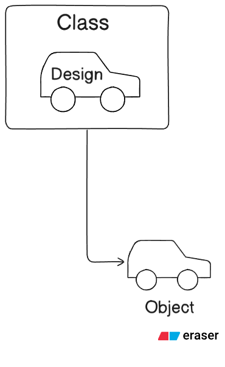
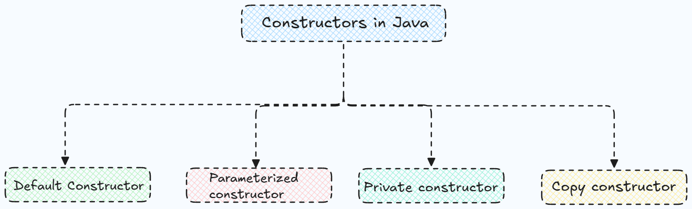
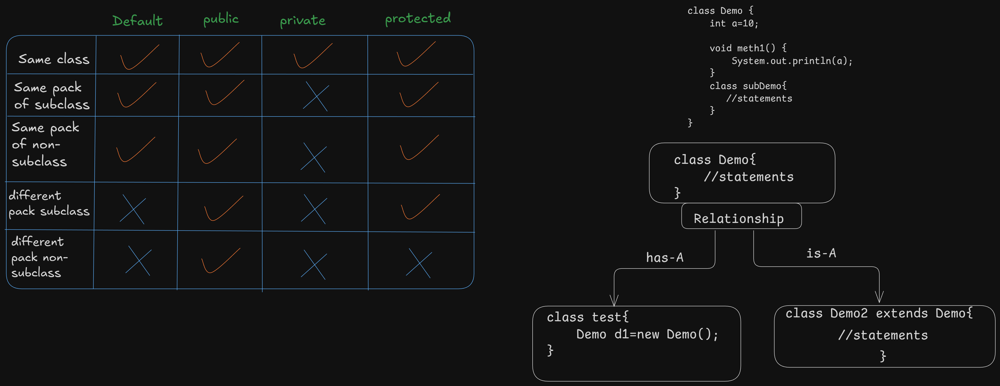

# Object Oriented Programming (OOPs)

object-oriented programming (OOP) is a programming paradigm that uses "classes" and "objects" to structure code. It is designed to increase modularity, reusability, and maintainability of code by organizing it around data and behavior.

## Principles of OOP

1. **Encapsulation**
    - Encapsulation is the bundling of data (attributes) and methods (functions) that operate on that data into a single unit called a class. It restricts direct access to some of an object's components, which can prevent the accidental modification of data.
2. **Abstraction**
    - Abstraction is the concept of hiding the complex implementation details and showing only the essential features of the object. It helps in reducing complexity and increases efficiency by allowing the user to interact with the object at a higher level.
3. **Inheritance**
    - Inheritance is a mechanism where a new class (called a subclass or derived class) can inherit properties and behaviors (attributes and methods) from an existing class (called a superclass or base class). This promotes code reusability and establishes a hierarchical relationship between classes.
4. **Polymorphism**
    - Polymorphism allows objects of different classes to be treated as objects of a common superclass. It enables a single interface to represent different underlying forms (data types). The most common use of polymorphism is when a method in a subclass overrides a method in its superclass.

### Why we use object-oriented programming when we can do the same with procedural programming?

   **Object-oriented programming provides us these features:**

- **Modularity**: OOP allows for better organization of code into classes and objects, making it easier to manage and understand.
- **Reusability**: Classes can be reused across different programs, reducing redundancy and saving development time.
- **Maintainability**: OOP makes it easier to maintain and update code, as changes can be made to individual classes without affecting the entire codebase.
- **Real-world modeling**: OOP provides a more intuitive way to model real-world entities and their interactions, making it easier to design complex systems.
- **Collaboration**: OOP facilitates teamwork by allowing multiple developers to work on different classes simultaneously without causing conflicts.
- **Extensibility**: OOP allows for easy extension of existing code through inheritance and polymorphism, enabling developers to add new features without modifying existing code.

## key Concepts of OOP

- **Class**: A blueprint for creating objects. It defines a set of attributes and methods that the created objects will have.
- **Object**: An instance of a class. It contains properties and behavior defined by the class.
- **Method**: A function defined within a class that describes the behaviors of the objects created from that class.
- **Attribute**: A variable defined within a class that holds data related to the objects created from that class.



---

**For every class inside a souce code file, there is a separate `.class` file created with the same name as the class name,no matter how many classes are there in a single source code file,and only one public class is allowed per source code file.**

---

## Data Hiding

Data hiding is a principle of OOP that restricts access to certain details of an object, exposing only what is necessary. This is typically achieved using access modifiers (like private, protected, and public) to control visibility of class members. Data hiding helps in protecting the integrity of the object's data and prevents unintended interference and misuse.

## How to achieve Data Hiding in Java?

By declaring class variables as private and providing public getter and setter methods to access and update the values of these variables.

```java
class Circle {
    private int radius;   // data hidden

    public void setRadius(int r) {
        radius = r;
    }

    public int getRadius() {
        return radius;
    }
}
```

---

## Types of Properties

1. **Read-Only Property**: A property that can only be read but not modified. This is typically achieved by providing only a getter method and no setter method.

    ```java
    class Circle {
        private int radius;
        public int getRadius() {
            return radius;
        }
    }
    ```

2. **Write-Only Property**: A property that can only be modified but not read. This is typically achieved by providing only a setter method and no getter method.

    ```java
    class Circle {
        private int radius;
        public void setRadius(int r) {
            radius = r;
        }
    }
    ```

3. **Read-Write Property**: A property that can be both read and modified. This is typically achieved by providing both getter and setter methods.

    ```java
    class Circle {
        private int radius;
        public int getRadius() {
            return radius;
        }
        public void setRadius(int r) {
            radius = r;
        }
    }
    ```

---

## Constructor in OOP

A constructor is a special method in a class that is automatically called when an object of that class is created. It is used to initialize the object's attributes and allocate resources if needed. Constructors have the same name as the class and do not have a return type.

**If no constructor is defined in a class, the compiler provides a default or implicit constructor that initializes the object with default values.**

## Types of Constructors



## There are four types of constructors in Java:

1.Default constructor

2.Parameterized constructor

3.Private constructor

4.Copy constructor

### 1. Default Constructor

**Implicit constructors:** If no constructors are explicitly defined in a Java class, the compiler automatically provides a default constructor. This implicit constructor initializes the object with default values (e.g., `null` for reference types,`0` for numeric types, and `false` for booleans).

**Non-parameterized Constructor:** Often referred to as a default constructor when explicitly defined, it doesn’t take any arguments and can be implemented to execute specific initialization logic.

```java
class Circle {
    private int radius;

    // Default constructor
    public Circle() {
        radius = 5; // default value
    }

    public int getRadius() {
        return radius;
    }
}
```

### 2. Parameterized Constructor

A parameterized constructor allows initializing instance variables with specific values at object creation, useful when the class has multiple instance variables that need unique values.

```java
    class Circle {
        private int radius;

        // Parameterized constructor
        public Circle(int r) {
            radius = r;
        }

        public int getRadius() {
            return radius;
        }
    }
```

### 3. Private Constructor

A private constructor is a constructor that is declared as private, meaning it cannot be accessed from outside the class.
Private constructors restrict the creation of objects from outside the class, commonly used in singleton patterns where only one instance of a class should exist across the application.

```java
class Singleton {
    private static Singleton instance;

    // Private constructor
    private Singleton() {
        // Initialization code
    }

    public static Singleton getInstance() {
        if (instance == null) {
            instance = new Singleton();
        }
        return instance;
    }
}
```

### 4. Copy Constructor

A copy constructor is a special type of constructor that creates a new object as a copy of an existing object. It takes another object of the same class as a parameter and copies its attributes to the new object.

```java
class Circle {
    private int radius;

    // Parameterized constructor
    public Circle(int r) {
        radius = r;
    }

    // Copy constructor
    public Circle(Circle c) {
        radius = c.radius;
    }

    public int getRadius() {
        return radius;
    }
}
```
## Access Modifiers in OOP

Access modifiers are keywords in object-oriented programming languages that define the visibility and accessibility of classes, methods, and variables. They help in implementing encapsulation by controlling access to the members of a class.

### Types of Access Modifiers

1. **Public**: Members declared as public are accessible from any other class.
2. **Private**: Members declared as private are accessible only within the class they are defined in.
3. **Protected**: Members declared as protected are accessible within the same package and by subclasses in other packages.
4. **Default (Package-Private)**: If no access modifier is specified, the member is accessible only within its own package.

```java
class Circle {
    public int radius;          // Public access
    private String color;       // Private access
    protected double area;      // Protected access
    int diameter;               // Default (Package-Private) access

    // Constructor and methods...
}
```

---

