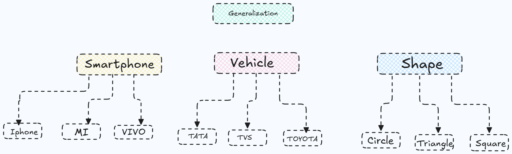
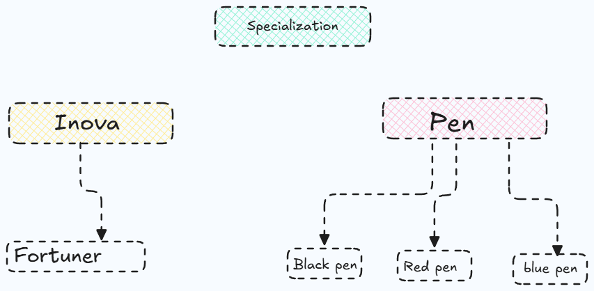
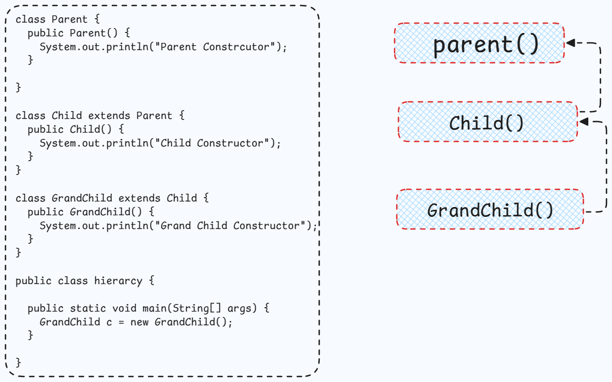
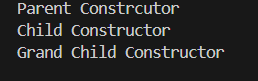

# Inheritance in Object-Oriented Programming

## Generalization and Specialization

- **Generalization**: The process of extracting shared characteristics from two or more classes and combining them into a generalized superclass. This helps to reduce redundancy and promote code reuse.



- **Specialization**: The process of creating new subclasses from an existing class by adding specific attributes or methods. This allows for more specific implementations while still inheriting common features from the superclass.



## INHERITANCE

Inheritance is a fundamental concept in object-oriented programming that allows a new class (subclass or derived class) to inherit properties and behaviors (attributes and methods) from an existing class (superclass or base class). This promotes code reuse and establishes a hierarchical relationship between classes.

- subclass (child) - the class that inherits from another class
- superclass (parent) - the class being inherited from


## 1. Single Inheritance

### Definition

A child class inherits from a single parent class.

### Example

```java
class Account {
    void showAccount() {
        System.out.println("Account details");
    }
}

class SavingAccount extends Account {
    void showBalance() {
        System.out.println("Balance shown");
    }
}

```

**Relationship:**

SavingAccount IS-A Account

---

## 2. Multilevel Inheritance

### Definition

A class inherits from another class, which itself inherits from a third class.

### Example

```java
class Account {
    void showAccount() {
        System.out.println("Account");
    }
}

class SavingAccount extends Account {
    void savingFeature() {
        System.out.println("Saving feature");
    }
}

class PremiumSavingAccount extends SavingAccount {
    void premiumFeature() {
        System.out.println("Premium feature");
    }
}

```

**Hierarchy:**

Account → SavingAccount → PremiumSavingAccount

---

## 3. Hierarchical Inheritance

### Definition

Multiple child classes inherit from the same parent class.

### Example

```java
class Account {
    void showAccount() {
        System.out.println("Account");
    }
}

class SavingAccount extends Account {
    void saving() {
        System.out.println("Saving Account");
    }
}

class LoanAccount extends Account {
    void loan() {
        System.out.println("Loan Account");
    }
}

```

**Hierarchy:**

One parent class with multiple child classes.

---

## NOTE:-A subclass inherits all non-private methods and attributes of its superclass that are accessible, but constructors are not inherited

**EXLAMPLE:-**

```java
  class Circle{
    private double radius;
    public void Circle(){
      radius=0.0;
    }
    public void Area(){
      // some operations
    }
    public void Perimeter() {
      //some operations
    }
  }

class Cylinder extends Circle{
  private double height;
  public void Cylinder(){
    height=0.0;
  }
  public void Volume(){
    //some operations
  }
}
public class Example{
  public static void main(String args[]) {
  
    Circle c1=new Circle();
    Cylinder c2=new Cylinder();

  }
}
```


---

## NOTE:-When we call the constructor of the subclass, the constructor of the superclass is called first, followed by the constructor of the subclass.



## Flow of execution in Inheritance



## This is how the memory is allocated in Inheritance

In inheritance, memory allocation follows a hierarchical structure where the subclass inherits properties and behaviors from the superclass. When an object of the subclass is created, memory is allocated for both the superclass and subclass attributes.

## This vs Super

- **this**: Refers to the current instance of the class. It is used to access class members (attributes and methods) and can also be used to call other constructors within the same class.
- The **this** keyword in Java refers to the current object in a method or constructor.
- The **this** keyword is often used to avoid confusion when class attributes have the same name as method or constructor parameters.
- **super**: Refers to the immediate parent class (superclass) of the current class. It is used to access superclass members and can also be used to call the superclass constructor.

## Example of this and super

```java
class Animal {
    void eat() {
        System.out.println("Animal is eating");
    }
}
class Dog extends Animal {
    void eat() {
        System.out.println("Dog is eating");
    }
    void bark() {
        System.out.println("Dog is barking");
    }
    void display() {
        this.eat(); // Calls Dog's eat method
        super.eat(); // Calls Animal's eat method
        this.bark(); // Calls Dog's bark method
    }
}
public class TestThisSuper {
    public static void main(String args[]) {
        Dog d = new Dog();
        d.display();
    }
}
```

**Output:**
```

Dog is eating
Animal is eating
Dog is barking
```

## Advantages of Inheritance

- **Code Reusability**: Inheritance allows for the reuse of existing code, reducing redundancy and improving maintainability.
- **Hierarchical Classification**: It helps in organizing classes in a hierarchical manner, making it easier to understand relationships between different classes.
- **Extensibility**: New functionalities can be added to existing classes without modifying them, promoting the open/closed principle.
- **Polymorphism**: Inheritance enables polymorphism, allowing objects of different classes to be treated as objects of a common superclass.
- **Improved Maintainability**: Changes made to the superclass automatically propagate to subclasses, simplifying maintenance tasks.

## Disadvantages of Inheritance

- **Tight Coupling**: Inheritance creates a strong dependency between the superclass and subclass
, making it difficult to modify one without affecting the other.
- **Increased Complexity**: Deep inheritance hierarchies can lead to complex code structures that are hard to understand and maintain.
- **Limited Flexibility**: Subclasses are constrained by the design of the superclass, which may limit their ability to implement specific behaviors.
- **Potential for Name Conflicts**: If a subclass defines a method or attribute with the same name as one in the superclass, it can lead to confusion and unexpected behavior.
- **Inheritance vs Composition**: Over-reliance on inheritance can lead to less flexible designs compared to composition, where objects are composed of other objects rather than inheriting from them.

---

## Method Overriding

## Definition

Method overriding is a feature in object-oriented programming that allows a subclass to provide a specific implementation of a method that is already defined in its superclass. When a method in a subclass has the same name, return type, and parameters as a method in its superclass, the subclass's method overrides the superclass's method.

**Method overriding** occurs when a subclass provides its **own implementation** of a method already defined in its superclass, using the **same method signature**.

It enables **runtime polymorphism**.

---

## How It Works

- The decision of which method to call is made **at runtime**
- It depends on the **object type**, not the reference type
- The JVM uses **dynamic method dispatch**

---

## Rules for Method Overriding

A method can be overridden only if:

1. Method name is **identical**
2. Parameter list is **identical**
3. Return type is **identical**
4. Access modifier is **the same or less restrictive**
5. Method is **not static**
6. Method is **not final**
7. Method is **not private**

---

## Example

```java
class A{
  public void Display() {
    System.out.println("printing Parent class..");
  }
}
class B extends A{

    @Override
    public void Display(){
      System.out.println("Printing Child Class...");
    }
}
public class method {
  public static void main(String arg[]){
      A a1=new A();
      a1.Display();
      B b1=new B();
      b1.Display();

  }
}

```

### Output

```
printing Parent class..
Printing Child Class...

```

---

## Why Use `@Override`

- Confirms the method **actually overrides** a parent method
- Helps the compiler catch signature errors
- Improves code readability and safety

### Example without `@Override`

```java
class A {
    public void display() {
        System.out.println("Parent class method");
    }
}
class B extends A {
    public void display(int x) { // Not overriding, just overloading
        System.out.println("Child class method with parameter: " + x);
    }
}
public class Test {
    public static void main(String[] args) {
        B b = new B();
        b.display(5); // Calls child class method
    }
}
```

### Output

```
Child class method with parameter: 5
```

In this example, the `display` method in class B does not override the method in class A because it has a different parameter list. Using `@Override` would have caused a compile-time error, alerting the developer to the mistake.

## What if you made object of Parent class refer to Child class

```java
class A{
  public void Display() {
    System.out.println("printing Parent class..");
  }
}
class B extends A{

    @Override
    public void Display(){
      System.out.println("Printing Child Class...");
    }
}
public class method {
  public static void main(String arg[]){
      A a1=new A();
      a1.Display();
      A b1=new B(); // Parent class reference to Child class object
      B c1=new A(); // This will give error
      b1.Display();

  }
}
```
### Output

```
printing Parent class..
Printing Child Class...
```

```
A b1 = new B()
```

is allowed because a subclass object can be referred to by a superclass reference (upcasting).

```
B c1 = new A()
```

is not allowed because a superclass object cannot be treated as a subclass, as it may not contain subclass-specific behavior.

---

## Advantages of Method Overriding

- **Runtime Polymorphism**: Enables dynamic method resolution at runtime, allowing for flexible and extensible code.
- **Code Reusability**: Allows subclasses to reuse methods from the superclass while providing specific implementations.
- **Improved Readability**: Enhances code clarity by allowing subclasses to define behavior that is specific to their context.
- **Extensibility**: Facilitates the addition of new functionality without modifying existing code,promoting the open/closed principle.

## Disadvantages of Method Overriding

- **Increased Complexity**: Can lead to more complex code structures that may be harder to understand and maintain.
- **Potential for Errors**: Incorrectly overriding methods can lead to unexpected behavior if the method signatures do not match.
- **Performance Overhead**: Dynamic method dispatch can introduce a slight performance overhead compared to static method calls.
- **Tight Coupling**: Subclasses become tightly coupled to the superclass, making changes in the superclass potentially disruptive to subclasses.

---

## Dynamic Method Dispatch

Dynamic Method Dispatch is a mechanism by which a call to an overridden method is resolved at runtime rather than compile-time. It is a key feature of polymorphism in object-oriented programming.

### How It Works

- When a method is called on a superclass reference that points to a subclass object, the JVM determines which method to execute based on the actual object type at runtime.

### example

```java
class Super{

  public void method1(){ System.out.println("Method 1 is called...");}
  
  public void method2() { System.out.println("Method 2 is calling..."); }
}
class SubClass extends Super{

  @Override
  public void method2(){ System.out.println("Method 2 SubClass is calling...");}
  
  public void method3() { System.out.println("Method 3 is calling..."); }

}

public class DynamicDispatch{
  public static void main(String args[]){
      Super s=new SubClass();
      s.method1();
      s.method2();// this will not give error as method2 is present in super class and overridden in sub class.
      // s.method3(); we can only call methods which are in super class 

      Super s1=new Super();
      s1.method2();

      SubClass s2=new SubClass();
      s2.method3();
    }
}
```

### Output

```
Method 1 is called...
Method 2 SubClass is calling...
Method 2 is calling...
Method 3 is calling...
```

## NOTE:-In the above example, the method2() of SubClass is called at runtime, demonstrating dynamic method dispatch. and we can only call methods which are in super class using super class reference.

## keep this in mind that final and static methods cannot be overridden, so they do not participate in dynamic method dispatch,and trying to override them will result in a compile-time error.
