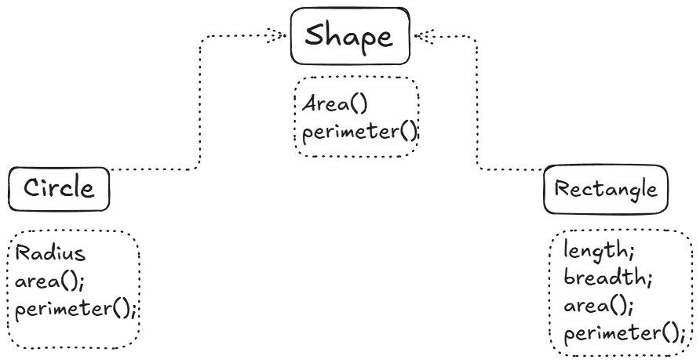

# Abstraction

Abstraction is a fundamental concept in computer science and software engineering that involves simplifying complex systems by hiding unnecessary details and exposing only the essential features. It allows developers to manage complexity, improve code readability, and enhance maintainability.
So basically, abstraction helps in focusing on what an object does instead of how it does it.

## Abstract classes

An abstract class is a class that cannot be instantiated on its own and is meant to be subclassed. It often contains one or more abstract methods that must be implemented by any concrete subclass. Abstract classes provide a way to define a common interface for a group of related classes while allowing for specific implementations in each subclass.

---

**NOTE:- we can have reference of abstract class but we cannot create object of abstract class.**

---

### Example of Abstract Class

**Refer to the Shape.java file.**

## Abstract Class Do and Don'ts 

### Do

- Use the `abstract` keyword with the class
- Declare abstract methods **without a method body**
- Combine abstract methods and concrete methods
- Extend the abstract class to use it
- Implement **all abstract methods** in a concrete subclass
- Mark the subclass `abstract` if **even one abstract method remains unimplemented**
- Use the same method name **and parameters** when overriding
- Add `@Override` when implementing abstract methods

---

### Don't

- Create an object of an abstract class
- Add a body to an abstract method
- Leave abstract methods unimplemented in a concrete class
- Change the method signature when overriding
- Declare abstract methods in a non-abstract class
- Combine `abstract` with `final`
- Expect Java to "understand what you meant"
