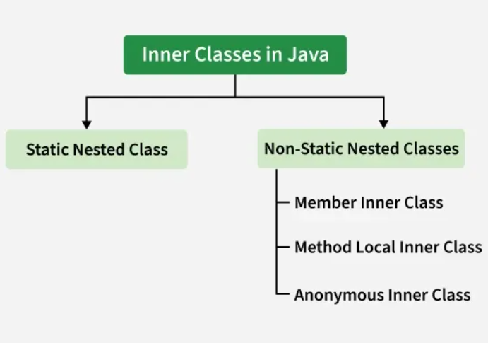

# Inner Classes In Java

An inner class is a class declared inside the body of another class. The inner class has access to all members (including private) of the outer class, but the outer class can access the inner class members only through an object of the inner class.

Syntax:

```java
class OuterClass {
     // Outer class members

    class InnerClass {
     // Inner class members
    }
}
```

## Features of Inner Classes

- **Encapsulation:** Inner classes can access private members of the outer class, providing better encapsulation.
- **Code Organization:** Logically groups classes that belong together, making code more readable.
- **Access to Outer Class:** Inner class instances have a reference to the outer class instance.
- **Namespace Management:** Helps avoid naming conflicts by nesting related classes.

## Types of Inner Classes

Java supports four types of inner classes:

1. Nested Inner Class
2. Local Inner Class
3. Static Nested Class
4. Anonymous Inner Class



## A non-static inner class has an implicit reference to its outer object, but that doesn’t mean the outer’s methods get copied into the inner

## 1. Nested Inner Class

A nested inner class is defined within the body of an outer class. It can access all members of the outer class, including private members.

```java

example:

class Outer{
    private int x=19;
    class inner{
        public void Display(){
            System.out.println("Inner method... : "+x);
        }
    } 
}
public class nestedClass{
  public static void main(String args[]){
    Outer outer=new Outer();
    Outer.inner in=outer.new inner();
    in.Display();
  }
}
```

## 2. Local Inner Class

Local inner classes are defined within a method of the outer class. They can access final or effectively final variables from the enclosing method.

```java

example:

class outer {
  public void Display(){
    class inner{
      public void show(){
        System.out.println("show method called..");
      }
    }
    inner i=new inner();
    i.show();
  }
}

public class localInner {
  public static void main(String[] args) {
    outer o=new outer();
    o.Display();
  }  
}
```

## 3. Static Nested Class

A static nested class is a static member of the outer class. It can access static members of the outer class but cannot access instance members directly.

```java
example:
class outer{
  static int x=10;
  static class inner{
    public void show(){
      System.out.println(x);
    }
  }
}

public class staticClass {
  public static void main(String[] args) {
    outer.inner in=new outer.inner();
    in.show();
  }
}
```

## 4. Anonymous Inner Class

An anonymous inner class is a class without a name that is defined and instantiated in a single expression. It is often used to provide a quick implementation of an interface or an abstract class.

```java

example:

abstract class my {
  abstract public void show();
}

class outer {
  public void Display() {
    new my() {
      public void show() {
        System.out.println("hello..");
      }
    }.show();
  }
}

public class Anom {
  public static void main(String[] args) {
    outer o = new outer();
    o.Display();
  }
}
```

## why we use Inner Classes?

1. **Logical Grouping:** Inner classes help to logically group classes that are only used in one place, improving code organization.
2. **Encapsulation:** Inner classes can access private members of the outer class, providing better encapsulation.
3. **Event Handling:** Inner classes are often used in GUI programming for event handling, allowing for cleaner and more maintainable code.
