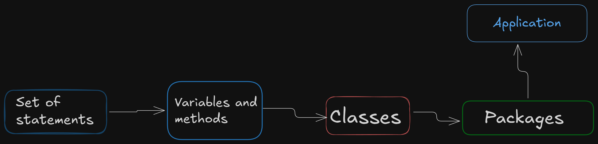

# Packages in Java

Just as directories on a computer are used to organize files, Java uses packages to organize classes and interfaces within an application. Packages function much like directories, helping developers write cleaner, more manageable, and well-structured code.

A package, as the name suggests, is a collection of related classes and interfaces grouped together. Classes that provide similar or related functionality are typically placed in the same package. Packages are created by the programmer, who decides which classes and interfaces belong within them.

In addition to classes and interfaces, a package may also contain other types such as enums, annotation types, and even subpackages.

**more technically:**

A package in Java is a namespace that groups related classes, interfaces, enums, and annotation types into a single logical unit, helping to organize code, avoid naming conflicts, and improve maintainability.

---

#### The image below shows a hierarchy of different java elements where each element is a subset of next element. For example a method is a group of statements, similarly an application is a group of packages.



---

## A package declaration looks like below :

```java
package packagename
example : package com.example.myapp;
package mypack;
```

- Example:

```java
package mypack1;
// this is a package
public class demo1 {
  public void display(){
    System.out.println("Hello from demo1");
  }
}
```

---

```java
package mypack1.inner;// this line creates a subpackage named inner inside mypack1

public class demo2{
  public void display(){
    System.out.println("Hello from demo2..");
  }
}
```

## Types of packages

Packages can be categorized in two types :

- User defined packages
- Built-in packages

### User defined packages

These are the packages that are created by the programmer to organize their own classes and interfaces. For example, if you are developing a library management system, you might create packages like `com.library.books`, `com.library.members`, and `com.library.transactions` to group related classes together.

### Built-in packages

Java provides a rich set of built-in packages that come with the Java Development Kit (JDK). These packages contain pre-written classes and interfaces that developers can use to perform common tasks. Some commonly used built-in packages include:

- `java.lang` : Contains fundamental classes such as `String`, `Math`, `Integer`, etc.
- `java.util` : Provides utility classes like `ArrayList`, `HashMap`, `Date`, etc.

## Creating and Using Packages

To create a package, you simply declare it at the top of your Java source file using the `package` keyword followed by the package name. The directory structure of your project should reflect the package hierarchy. For example, if you declare a package as `com.example.myapp`, your source file should be located in a directory structure like `com/example/myapp/`.
To use classes from a package, you can either import the entire package or specific classes using the `import` statement. For example:

```java
import com.example.myapp.MyClass; // Importing a specific class
import com.example.myapp.*; // Importing all classes from the package
```

Using packages effectively helps in maintaining a clean codebase, avoiding naming conflicts, and enhancing code reusability across different projects.

commands to create and use packages

```bash
# Create directory structure for package
javac -d . packagename.java
```

when you have imported a package in your java file, you have to create a object of the class to use its methods.

```java
import mypack1.demo1;
import mypack1.inner.demo2;
import mypack1.myMath.Add;
//we are importing all created package in this main file
public class Main{
  public static void main(String[] args) {
    demo1 d1=new demo1();
    d1.display();
    demo2 d2=new demo2();
    d2.display();
    Add a1=new Add();
    System.out.println("Sum of two number is  : "+a1.addition(1,2));
  }
}
```

This code demonstrates how to import and use classes from different user-defined packages in a Java application.

---