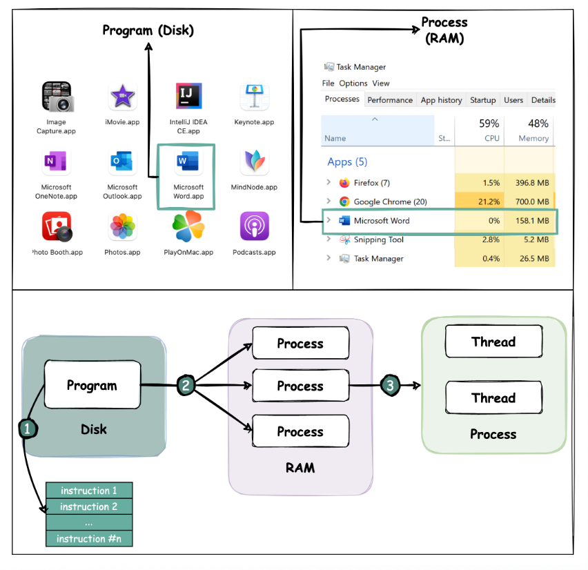
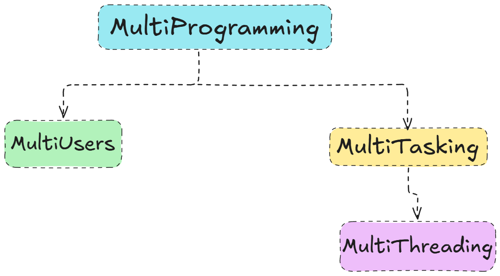
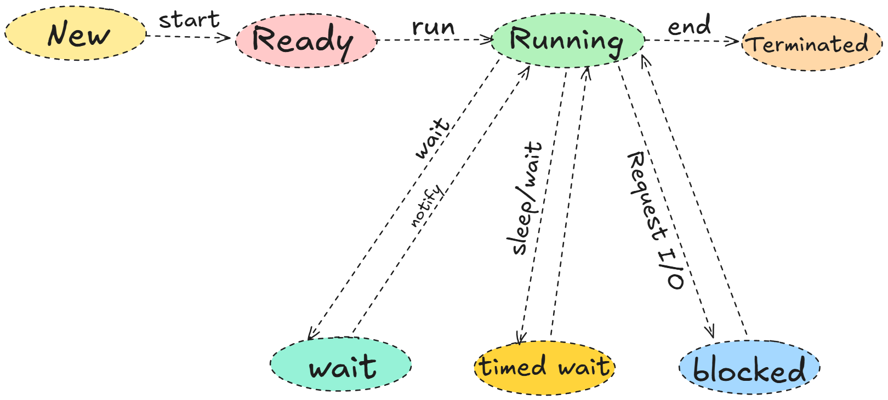

# MultiThreading

## why we need multiprogramming?

- To maximize CPU utilization.
- To increase system throughput.
- To reduce waiting time for processes.
for example: you are using a computer to type a document, while the computer is also downloading a file in the background. The CPU switches between these tasks, allowing you to work on your document while the download continues without interruption.

## What is Program?

A program is a set of instructions written in a programming language that performs a specific task when executed by a computer. It is a static entity that resides on disk (like an executable file) and does not perform any action until it is loaded into memory and run by the operating system.

## what is process?

A process is an instance of a program that is being executed by the computer. It is a dynamic entity that includes the program code, its current activity (such as the value of the program counter and registers), and the resources allocated to it (like memory, file handles, etc.). Each process operates independently and has its own memory space.

## what is a thread?

A thread is the smallest unit of execution within a process. It is a sequence of instructions that can be managed independently by the operating system. A process can contain multiple threads, which share the same memory space and resources of the parent process but can execute concurrently. This allows for more efficient use of CPU resources and enables multitasking within a single application.

## The main differences between Program, Process, and Thread are:

1. **Definition:**
   - Program: A static set of instructions stored on disk.
   - Process: An active instance of a program in execution.
   - Thread: The smallest unit of execution within a process.

2. **State:**
    - Program: Inactive until executed.
    - Process: Active and has its own state (e.g., running, waiting).
    - Thread: Active and shares the state of its parent process.

3. **Resource Allocation:**
    - Program: Does not require resources until executed.
    - Process: Allocated its own memory and resources.
    - Thread: Shares resources with other threads in the same process.

4. **Concurrency:**
    - Program: Cannot execute concurrently.
    - Process: Can run concurrently with other processes.
    - Thread: Can run concurrently with other threads within the same process.

## Program vs Process vs Thread



#

## Main differences between process and thread:

  - Processes are usually independent, while threads exist as subsets of a process.

  - Each process has its own memory space. Threads that belong to the same process share the same memory.

  - A process is a heavyweight operation. It takes more time to create and terminate.

  - Context switching is more expensive between processes.

  - Inter-thread communication is faster for threads.
## what is multiprogramming

Multiprogramming is a method where multiple programs are loaded into memory and the CPU switches between them to maximize resource utilization. It allows multiple processes to reside in memory simultaneously, enabling the CPU to execute one process while others wait for I/O operations to complete. This improves overall system efficiency and throughput by keeping the CPU busy.

### more layman terms:

#### Running more than one program that is running multiple programs on a single machine or a computer is known as multi-programming.

#### The idea of multiprogramming started from the utilisation of the CPU when it is idle as the CPU works for just few time in the whole hour.

#

There are different forms of multi-programming.



#

- **Multi-user:** More than one user using the machine or running their programs simultaneously.
  - Dummy terminals were used to connect multiple users to a single computer.
  - The round-robin method was introduced to execute programs simultaneously.
  - UNIX and Linux are well-known operating systems for multi-user environments.
  - Multi-user machines were known as time-sharing machines.


#

- **Multi-Tasking:** A single user runs multiple tasks simultaneously.

  - The CPU runs programs alternately at high speed.
  - Windows and macOS (OS X) operating systems support this type of environment.

#

- **Multithreading:** A technique where multiple tasks run concurrently within a single application.
  - Threads are lightweight compared to full processes.
  - The CPU switches between threads rapidly, creating the illusion that they're running simultaneously.
  - Multithreading improves application responsiveness and resource utilization.

- ## Examples of Multithreading:

  - **Web Servers:** Handle multiple client requests simultaneously using threads.

  - **Graphical User Interfaces (GUIs):** Keep the interface responsive while performing background tasks.

  - **Games:** Manage multiple game entities and user inputs concurrently.

  - **Data Processing Applications:** Perform parallel computations on large datasets using multiple threads.

---

## Advantages of Multithreading:

1. **Improved Responsiveness:** Multithreading allows applications to remain responsive to user input while performing background tasks.
2. **Resource Sharing:** Threads within the same process share memory and resources, leading to efficient resource utilization.
3. **Faster Context Switching:** Switching between threads is generally faster than switching between processes, reducing overhead.
4. **Parallelism:** On multi-core processors, threads can run in parallel, improving performance for CPU-bound tasks.

## Disadvantages of Multithreading:

1. **Complexity:** Writing and managing multithreaded applications can be more complex due to issues like synchronization and deadlocks.
2. **Debugging Challenges:** Debugging multithreaded applications can be more difficult due to race conditions and timing issues.
3. **Resource Contention:** Threads may compete for shared resources, leading to potential performance bottlenecks.
4. **Increased Overhead:** While lighter than processes, threads still incur some overhead for management and context switching.

## Multithreading in Java:

Java provides built-in support for multithreading through the `Thread` class and the `Runnable` interface. Developers can create and manage threads easily, allowing for concurrent execution of tasks within Java applications.

### Creating a Thread in Java using the `Thread` class:

  ```java
  class MyThread extends Thread {
      public void run() {
          System.out.println("Thread is running");
      }
      
      public static void main(String[] args) {
          MyThread thread = new MyThread();
          thread.start(); // Start the thread
      }
  }
  //or you can do it with using different class look at ThreadClass1.java file
  ```

### Creating a Thread in Java using the `Runnable` interface:

  ```java
    class MyRunnable implements Runnable {
        public void run() {
            System.out.println("Runnable thread is running");
        }
        
        public static void main(String[] args) {
            Thread thread = new Thread(new MyRunnable());
            thread.start(); // Start the thread
        }
    }
    //or you can do it with using different class look at RunnableClass1.java file
  ```

---

## Thread Lifecycle or States in Java:



1. **New:** A thread is created but not yet started.
2. **Runnable:** The thread is ready to run and waiting for CPU time.
3. **Running:** The thread is currently executing.
4. **Terminated:** The thread has completed its execution.
5. **Blocked:** The thread is waiting for a resource or I/O operation to complete.
6. **Waiting:** The thread is waiting indefinitely for another thread to perform a particular action.
7. **Timed Waiting:** The thread is waiting for a specified period of time.

---

## Thread Priorities in Java:

Java allows you to set thread priorities to influence the order in which threads are scheduled for execution. Thread priorities range from `MIN_PRIORITY` (1) to `MAX_PRIORITY` (10), with `NORM_PRIORITY` (5) as the default.

- **MIN_PRIORITY (1):** The lowest priority.
- **NORM_PRIORITY (5):** The default priority.
- **MAX_PRIORITY (10):** The highest priority.


Even if a high priority is assigned to a Java thread, there is no guarantee that it will execute immediately or before a lower-priority thread. This is because Java thread scheduling ultimately depends on the operating system’s scheduler. Modern operating systems use preemptive, time-sliced scheduling, meaning a currently running low-priority thread may continue executing until its allotted time slice expires, even if a higher-priority thread becomes runnable during that time.

Although the JVM may prefer a high-priority thread and request the operating system to schedule it earlier, the JVM itself cannot control CPU execution. Since the JVM is just a user-level program running on the operating system, the final decision about which thread executes always lies with the OS scheduler. Therefore, while thread priorities can influence scheduling, they do not guarantee execution order.

Java has its own thread scheduler that works in conjunction with the underlying operating system's thread scheduling mechanism. The Java Virtual Machine (JVM) relies on the OS to manage thread scheduling, but it can provide hints about thread priorities and states.Multithreading features are provided by the operating systems but in java JVM have its own scheduler.

Now the question is how the JVM schedules threads?

The JVM uses a priority-based scheduling algorithm, where threads with higher priority are given preference for CPU time over lower-priority threads. However, the actual scheduling is ultimately determined by the operating system's thread scheduler, which may implement its own policies and algorithms.

 **Question 1:** Can a lower-priority thread ever starve a higher-priority thread in Java?

  Yes, it is possible for a lower-priority thread to starve a higher-priority thread in Java, especially if the operating system's scheduler does not strictly enforce priority-based scheduling. This situation can occur in systems where the scheduler uses time-slicing or other algorithms that do not guarantee that higher-priority threads will always get CPU time before lower-priority threads. However, such scenarios are relatively rare in modern operating systems that implement fair scheduling policies.

**Question 2:** How can we prevent thread starvation in Java?

  To prevent thread starvation in Java, developers can use several strategies:

  1. **Use Fair Locks:** When using synchronization mechanisms like `ReentrantLock`, opt for fair locks that grant access to threads in the order they requested it.
  2. **Avoid Priority Inversion:** Be cautious when using thread priorities, as they can lead to priority inversion. Consider using techniques like priority inheritance to mitigate this issue.
  3. **Monitor Thread States:** Regularly monitor the states of threads to ensure that no thread is being starved of CPU time.

**Question 3:** What if we set thread priority invalid values in Java?

  In Java, if you attempt to set a thread's priority to an invalid value (less than 1 or greater than 10), the JVM will throw an `IllegalArgumentException`. The valid range for thread priorities in Java is from `Thread.MIN_PRIORITY` (1) to `Thread.MAX_PRIORITY` (10). Attempting to set a priority outside this range will result in an error, ensuring that thread priorities remain within acceptable limits.


---

## Thread Class in Java:

The `Thread` class in Java is a built-in class that provides the necessary methods and properties to create and manage threads. It is part of the `java.lang` package and serves as the foundation for multithreading in Java.

## Some points about Thread class:

1. Object of the Thread class can also be created.
2. Whenever a thread is created it gets some IDE.
3. Threads can be identified by their names.

## There are different constructors to give the thread classes: 

Thread()
 Default constructor.

Thread(Runnable r)
Creates a thread with a runnable interface.

Thread(Runnable r, String name)
Creates a thread with a runnable interface and a custom name.

Thread(ThreadGroup g, String name)
Creates a thread within a thread group to manage multiple threads together.

For example:
In MS Word, one thread takes input from the keyboard, another thread checks spelling simultaneously, and another thread auto-saves the document. The first priority is given to the thread that takes the input.

Thread(String name)
Creates a thread with a custom name.
Thread(ThreadGroup g, Runnable r)
Creates a thread within a thread group with a runnable interface.
Thread(ThreadGroup g, Runnable r, String name)
Creates a thread within a thread group with a runnable interface and a custom name.
Thread(ThreadGroup g, Runnable r, String name, long stackSize)
Creates a thread within a thread group with a runnable interface, a custom name, and a specified stack size.

## Methods of Thread class:

### Getter and Setter Methods:

long threadId() OR getId()
Returns the ID of a particular thread.

String getName()
Returns the name of the thread.

int getPriority()
Returns the current priority of the thread.

Thread.State getState()
Returns the state of the thread.

ThreadGroup getThreadGroup()
Returns the group to which the thread belongs.

void setName(String name)
Sets the name of the thread.

void setPriority(int p)
Sets the priority of the thread.

void setDaemon(Boolean d)
Sets a background thread with the lowest priority and no user interaction.

For example:
Different types of balloons or balls in an animation, each having their own thread class, demonstrate a thread group.

For example:
The garbage collector in the JVM has the least priority.

### Inquiry Methods:

boolean isAlive()
Checks if the thread is alive or terminated.

boolean isDaemon()
Checks if the thread is acting as a daemon.

boolean isInterrupted()
Checks whether the thread has been interrupted.

### Instance Methods:

void interrupt()
Interrupts the thread, typically when it's waiting or sleeping.

void join()
Keeps the thread waiting to join with another thread until it completes.

void join(long millis)
Joins the main thread with another for a specified period of time.

void run()
Contains the actual functionality of the thread and can be overridden.

void start()
Starts the thread.

### Static Methods:

These can be called using the class name.

int activeCount()
Returns the number of active threads in a particular group.
Thread currentThread()
Returns a reference to the current or running thread.

void yield()
Signals higher-priority threads to wait briefly, allowing lower-priority threads to finish their work.

void dumpStack()
Displays the contents or depth of the stack.

## Go to the official documentation for more methods and details:

[Click Here!!](https://docs.oracle.com/javase/8/docs/api/java/lang/Thread.html)

---

## Types of Threads in Java:

1. **User Threads:** These are the main threads that perform the primary tasks of an application. They continue to run until they complete their execution or are explicitly terminated. User threads have higher priority than daemon threads.
2. **Daemon Threads:** These are background threads that provide services to user threads. They run in the background and do not prevent the JVM from exiting when all user threads have finished executing. Daemon threads typically have lower priority than user threads. Examples include garbage collection and background monitoring tasks.

3. **Main Thread:** This is the primary thread that is created when a Java application starts. It is responsible for executing the `main()` method and can create additional threads as needed.The main thread ends when the `main()` method completes execution.
4. **Worker Threads:** These are threads that perform specific tasks or operations, often in the background. They are typically created by user threads to handle tasks such as processing data, performing calculations, or handling I/O operations.

---

## Synchronization in Java:

Synchronization is a mechanism in Java that ensures that multiple threads can safely access shared resources without causing data inconsistency or corruption. It is essential in multithreaded applications where threads may concurrently read and write to shared variables or objects.

## How does Synchronization Work in Java?

In Java, synchronization is achieved using the `synchronized` keyword, which can be applied to methods or blocks of code. When a thread enters a synchronized method or block, it acquires a lock on the object (or class, if it's a static method) being synchronized. This lock prevents other threads from entering any synchronized methods or blocks on the same object until the lock is released (when the thread exits the synchronized method or block).

## Why is Synchronization Important?

Synchronization is important because it helps prevent issues such as:

- **Race Conditions:** When multiple threads access shared data simultaneously, leading to unpredictable results.
- **Data Inconsistency:** When one thread modifies shared data while another thread is reading it, resulting in incorrect or inconsistent values.
- **Deadlocks:** When two or more threads are waiting for each other to release resources, causing the application to hang.

## Key Concepts in Synchronization:

#

## Resource Sharing

Resource sharing refers to the concurrent access of a single logical or physical resource by multiple threads or processes within a system. In operating systems and concurrent programming, shared resources commonly include memory locations, objects, files, and hardware devices. Resource sharing is essential for efficiency and cooperation, but it introduces the risk of inconsistent system states when concurrent executions interfere with one another. Correct handling of resource sharing therefore requires well-defined synchronization mechanisms to preserve correctness and consistency.

## Critical Section

A critical section is a region of a program that accesses shared resources and must be executed atomically with respect to other concurrent execution units. The defining property of a critical section is that concurrent execution by more than one thread or process would lead to incorrect behavior. The critical section problem formalizes the need to design protocols that ensure correct entry and exit conditions, guaranteeing safe access to shared data in concurrent systems.

## Mutual Exclusion

Mutual exclusion is the property that ensures only one thread or process at a time can execute a critical section associated with a shared resource. It is a fundamental requirement for preventing race conditions and maintaining data integrity. Mutual exclusion does not prescribe how exclusivity is enforced, but it defines the correctness condition that synchronization mechanisms must satisfy to ensure safe concurrent execution.

## Locking and Mutex

Locking is a concrete mechanism used to enforce mutual exclusion, typically implemented through mutexes. A mutex is a synchronization primitive that provides exclusive access to a shared resource by allowing only one thread to hold the lock at a time. Threads attempting to acquire a mutex that is already held are forced to wait until it is released. Locking establishes a disciplined protocol for entering and exiting critical sections, but improper use can result in deadlock, starvation, or reduced system performance.

## Semaphore

A semaphore is a general-purpose synchronization construct that consists of an integer counter and a set of atomic operations used to manipulate it. Semaphores can be used to enforce mutual exclusion, manage access to a finite number of identical resources, or impose ordering constraints among threads. Unlike mutexes, semaphores do not enforce ownership, meaning the thread that signals a semaphore need not be the one that previously waited on it. This flexibility increases expressive power but also raises the likelihood of programming errors.

## Race Condition

A race condition occurs when the outcome of a program depends on the relative timing or interleaving of concurrent threads, and that timing is not properly controlled. Race conditions typically arise from unsynchronized access to shared mutable state and lead to nondeterministic and often incorrect behavior. Preventing race conditions requires identifying critical sections and protecting them using synchronization mechanisms that enforce mutual exclusion and memory visibility.

## Inter-Thread Communication

Inter-thread communication encompasses the mechanisms by which threads coordinate execution and exchange information beyond simple mutual exclusion. This communication may occur through shared variables protected by synchronization or through explicit signaling mechanisms such as condition variables. Inter-thread communication enables threads to wait for events, signal state changes, and enforce execution ordering, forming the foundation for higher-level concurrency patterns and coordinated parallel behavior.

### Monitors

A monitor is a high-level synchronization construct that encapsulates shared data together with the operations that access it and the synchronization mechanisms that ensure safe concurrent use. The concept was introduced by C. A. R. Hoare in the context of operating systems as a disciplined way to achieve mutual exclusion and coordination among concurrent processes. In Java, every object implicitly acts as a monitor, meaning that it is associated with a lock and a set of condition queues managed by the runtime system.

The primary feature provided by a monitor is mutual exclusion. Mutual exclusion ensures that at most one thread can execute a critical section of code associated with the monitor at any given time. In Java, when a thread enters a synchronized method or a synchronized block guarded by an object, it must first acquire that object’s monitor lock. While the lock is held, no other thread can enter any other synchronized region guarded by the same monitor, thereby preventing race conditions on shared state.

A second essential feature of a monitor is condition synchronization. Condition synchronization allows threads to suspend execution until a specific condition on shared state becomes true, and to be resumed when another thread signals that condition. In Java, this functionality is provided through the wait, notify, and notifyAll methods, which are intrinsically tied to an object’s monitor. A thread calling wait releases the monitor lock and enters the monitor’s wait set, while a thread calling notify or notifyAll signals waiting threads that a condition may have changed.

Monitors also provide well-defined memory visibility guarantees. According to the Java Memory Model, acquiring a monitor establishes a happens-before relationship with the previous release of the same monitor. This ensures that changes made to shared variables by one thread before releasing the lock become visible to another thread after it acquires the same lock. Without this property, even mutually exclusive execution would not be sufficient to guarantee correctness in the presence of modern processor and compiler optimizations.

## Creation and Management of Monitors in Java

In Java, every object is created with an associated monitor implicitly, as defined by the Java language and runtime, but that monitor remains idle until a thread executes a synchronized construct. When a thread enters a synchronized method or a synchronized block, the Java Virtual Machine automatically attempts to acquire the monitor associated with the specified object, and only upon successful acquisition does the thread proceed. When the thread exits the synchronized region, either normally or due to an exception, the monitor is automatically released. Thus, programmers do not manually create, enable, or manage monitors; they exist by default for every object and are automatically engaged by the JVM precisely at the points where synchronization is declared.

[LINK](https://www.notion.so/Some-questions-2d55bd8eddd080d0825ff5d9aa5df6c4?source=copy_link)

---

## Multithreading vs. Parallel Computing

While multithreading and parallel computing are often used interchangeably, they represent **distinct concepts** with different goals, characteristics, and use cases. Understanding this difference is essential when designing performance-critical Java applications, especially for concurrent or compute-intensive workloads.

### What Is Parallel Computing?

**Parallel computing** divides a large problem into smaller sub-problems that execute **simultaneously** across multiple processors or cores. Its goal is to **reduce execution time** by efficiently using hardware resources.

In Java, parallel computing is commonly used for:

- **CPU-bound tasks** (e.g., number crunching, simulations)
- **Data-parallel operations** (e.g., processing large array elements)
- **Batch processing** or **fork/join algorithms**

Java provides several tools for parallel computing:

- **Fork/Join Framework** (`java.util.concurrent.ForkJoinPool`)
- **Parallel streams** (`Stream.parallel()`)
- **Parallel arrays** in frameworks like Java Concurrency or third-party libraries

### Key Differences: Multithreading versus Parallel Computing

The following table compares multithreading with parallel computing:

| **Feature** | **Multithreading** | **Parallel Computing** |
| --- | --- | --- |
| **Primary Goal** | Improve responsiveness and task coordination | Increase speed through simultaneous computation |
| **Typical Use Case** | I/O-bound or asynchronous tasks | CPU-bound or data-intensive workloads |
| **Execution Model** | Multiple threads, possibly interleaved on one core | Tasks distributed across multiple cores or processors |
| **Concurrency vs. Parallelism** | Primarily concurrency (tasks overlap in time) | True parallelism (tasks run at the same time) |
| **Thread Communication** | Often requires synchronization | Often independent tasks (less inter-thread communication) |
| **Memory Access** | Threads share memory | May share or partition memory |
| **Java Tools & APIs** | `Thread`,`ExecutorService`,`CompletableFuture` | `ForkJoinPool`,`parallelStream()`, and`ExecutorService`configured for CPU-bound tasks |
| **Performance Bottlenecks** | Thread contention, deadlocks, synchronization latency | Poor task decomposition, load imbalance |
| **Scalability** | Limited by synchronization and resource management | Limited by number of available CPU cores |
| **Determinism** | Often non-deterministic due to timing and order | Can be deterministic with proper design |

### When to Use Parallel Computing in Java

Use parallel computing when your application performs **heavy, repetitive, or large-scale computations** that can be broken into **independent subtasks**. This includes:

- Image and video processing
- Mathematical simulations (e.g., physics, finance, statistics)
- Large dataset analysis
- Matrix or vector operations
- File parsing or transformation in batch jobs
