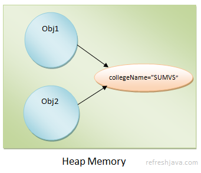

# Static and Final in Java

## Static Keyword

The `static` keyword in Java is used to indicate that a particular member (variable or method) belongs to the class itself rather than to instances of the class. This means that there is only one copy of the static member, shared among all instances of the class.
more formally:
Generally you need an object of a class to access members like variables and methods of that class, because these members belongs to object or instance of that class. Each object have their specific values for such members. But sometimes we need members that should belong to class rather than objects and should be same for all the objects. To achieve this java provides static keyword. static members belongs to class not objects. You can access such members using class name itself rather than objects. Let's see the different usage of static keyword.

There are four main types of static members in Java:

- static variable
- static method
- static block
- static inner class

## Java Static Variable

A `static` variable is similar to a normal variable except that it includes a `static` keyword in its declaration. `static` variables are also called **`class variables`** because they belong to the class, not to objects. These variables must be created inside the class but outside any method or block. If you create a `static` variable inside any static or non-static method or block, the compiler will throw a compilation error. The basic **syntax** for declaring a `static` variable is:

```java
 class className {

   access_modifier static dataType varName;
   access_modifier static dataType varName = value;    
 
 } 
  
 **Example:**
   
 class Student {   
 
   static int total;
   public static String collegeName = "SUMVS";         

 }
```

The access modifier of a `static` variable can be `public, protected, private` or default (no modifier). The access modifier determines the visibility and accessibility of the variable within or outside the class. The data type of a `static` variable can be a primitive or non-primitive data type. The variable name is chosen by the programmer. The value of a `static` variable can be assigned during declaration or later in the program. If `static` variables are not initialized with a value, Java will assign a default value based on their data type.

### Static Variable Memory Allocation

As soon as the Java Virtual Machine loads your class into memory, `static` variables are created in the heap memory. They are created only once, not separately for each object like instance variables. When your program finishes executing, `static` variables are removed from memory.

`static` variables belong to the class and are shared by all objects of that class. There is only one copy of a `static` variable, shared among all objects. If you change the variable's value using one object, all other objects will see the updated value. The image below shows how two objects `obj1` and `obj2` of the `Student` class share a `static` variable `collegeName`, which is created only once.



### How to Access Static Variables in Java

Since `static` variables belong to the class, you can access them using the class name as **`className.staticVarName`**. You can also access a `static` variable using an object of the class as **`objName.staticVarName`**, but you should prefer using the class name since `static` variables belong to the class, not objects. You can access `static` variables inside static or non-static methods or blocks.

You can access `static` variables directly inside your class. Outside the class (in other classes), you must use the class name or object name to access the `static` variables.

### Static Variable Program in Java

```java
 class Student { 
      static int total = 40;
      static String collegeName = "SUMVS";  
   }

 class StaticVarDemo { 
      static String test = "Testing static variable"; 
            
      public static void main(String [] args) {  
           System.out.println(test+ ", "+ StaticVarDemo.test);                
           // Accessing Student class static variables                  
           System.out.println("Total students = "+ Student.total);
           System.out.println("college name = "+ Student.collegeName);
        }       
   }
```

**Output:**

```
Testing static variable, Testing static variable
Total students = 40
college name = SUMVS
```

### When to Create a Static Variable

You should create a `static` variable when you need a variable that is the same for all objects of a class—in other words, a variable that doesn't differ between objects. For example, a `Student` class can have a `static` variable called `collegeName`, since it will be the same for all students of a college. Variables like `name, age, rollNo` should be declared as instance variables since they will be different for each student.

## Static Method in Java

A `static` method is similar to a normal method except that it includes a `static` keyword in its declaration. The basic **syntax** for declaring a `static` method is:

```java
 access_modifier static return_type methodName(DataType param1, DataType param2 ...)
   {
      // one or more line of code
      return some_value; // Needed if return_type is not void
   }

 **Example:** 
 
 public static int getArea() {
     // one or more line of code
     return some_value;
  } 
  
 static void calculateVolume(double radius) {
     // one or more line of code
  }
```

The access modifier of a method can be `public, protected, private` or default (no modifier). The access modifier determines the visibility and accessibility of the method within or outside the class. The **`return type`** of a method can be a primitive or non-primitive data type. If the method doesn't return a value, its return type must be `void`. The method name is chosen by the programmer. Parameters are optional—a `static` method may or may not have parameters.

### How to Access Static Methods in Java

Since `static` methods belong to the class, you can access them using the class name as **`className.methodName()`**. You can also access a `static` method using an object as **`objName.methodName()`**, but you should prefer using the class name since `static` methods belong to the class, not objects. Static methods cannot access non-static variables or methods directly—doing so will result in a compilation error. You can create and access local variables inside static methods as you do in normal methods.

You can access `static` methods directly inside your class. Outside the class (in other classes), you must use the class name or object name to access the `static` methods.

### Static Method Program in Java

```java
 class Student { 
      static int total = 50;
      static String collegeName = "SUMVS"; 
                  
      public static void printDetail() {                  
           System.out.println("total students = "+ total);
           System.out.println("college name = "+ collegeName);
      }    
   }

 class StaticMethodDemo { 
      int count = 20;
      static String test = "Learning static method"; 
            
      public static void main(String [] args) {                  
           StaticMethodDemo.testMethod();
           // testMethod(); // Can access testMethod directly as well.
           Student.printDetail(); // Calling printDetail method of Student class
           // printDetail() // Can't access other class static method directly.           
        }
      static void testMethod() {                  
           // count = count+2; // Static method can't access non-static variables
           int num = 30;
           System.out.println(test+ ", num = "+num);
      }    
   }
```

**Output:**

Learning static method, num = 30

total students = 50

college name = SUMVS

### When to Use Static Methods in Java

There are no strict rules, but here are some guidelines for creating `static` methods:

- You want to call a method without creating an instance of the class.
- The method doesn't need to access or modify instance variables.
- The method works only on the arguments provided to it. For example, `static int factorial(int number)` operates only on the `number` provided to it.
- It's a utility method. For example, built-in methods of the `Math` class like `log10(double a), sqrt(double a), cbrt(double a)` are utilities that perform common operations without requiring any object state.

## Static Block in Java

A `static` block is a block of code that is executed when the class is loaded into memory by the Java Virtual Machine (JVM). It is used to initialize `static` variables or perform any setup operations that need to be done only once, regardless of how many objects of the class are created.


The basic **syntax** for declaring a `static` block is:

```java
 static {
     // one or more line of code
 }
```

```java
public class StaticClass {
  static{
    System.out.println("Block 1");
  }  
  public static void main(String args[]){
    System.out.println("Main");
  }
  static {
    System.out.println("Block 2");
  }
} 
```

**Now, the question arises that why “Main” is printing at last?**

Because Java has a very strict sense of **time** when it comes to class loading, and `main` is *fashionably late* by design.

Here’s the sequence, step by step, without mysticism:

When the JVM starts your program, it does **not** jump straight into `main`. First, it must **load and initialize the class**. Class initialization means:

1. Execute **all static initialization blocks**
2. Execute them **in the exact order they appear in the source file**
3. Only *after that* call `main`

So for class:

```java
static {
  System.out.println("Block 1");
}

publicstaticvoidmain(String args[]) {
  System.out.println("Main");
}

static {
  System.out.println("Block 2");
}

```

What the JVM does:

- Class is loaded

- Static block 1 runs → prints `Block 1`

- Static block 2 runs → prints `Block 2`

- Static initialization is now complete


`main` is invoked → prints `Main`

That’s why the output is:

```
Block1
Block2
Main

```

Even though `main` appears *between* the static blocks in the file, it is **not** a static initializer. It’s just a static method, and methods don’t run unless explicitly called. The JVM calls `main` only **after** class initialization finishes.

## Some Intresting code snippets related to static.

```java
class St {

  static {
    System.out.println("Block 1");
  }
  static {
    System.out.println("Block 2");
  }
}

public class StaticClass {
  public static void main(String args[]) {
    // St s=new St();// block 1 and block 2 will print first
    System.out.println("Main");
    St s = new St();// block 1 and block 2 will print Second
    /*
     St s=new St();
     St s1=new St();
     now in this s1 will not printed in console because
    JVM check if class St is intialized or not, if no then 
    it will initialize it by executing static blocks only once.
     */
  }
}
```

---

# What is final keyword in Java

In java final is a keyword which is quite used in java programs. In real life when we say something is final, it means we can not change that later, the same applies with final keyword in java as well. When a member in java is declared as final, it's value or definition can not be changed later.

## What is the use of final keyword in Java

The final keyword is used to make a member as final. Once a member is declared as final, it's definition or value can not be changed later. In java final keyword can be used with following members :

**Variable** - Value of final variable can not be changed once initialized.

**Method** - Final method can not be overridden.

**Class** - Final classes can not be inherited.

## What is final variable in Java

A variable declared with final keyword is known as final variable. Once a final variable is initialized with some value, we can not change it's values later in the program, that is what the final keyword do when used with variable.

The syntax of declaring final variable is :

```
 final data_type var_name = value;
 Ex.
 final int total_hours = 24;
 final double PI = 3.1415;
 // Value can be assigned in constructor as well

```

**Note :** `final` keyword must be used before the data type of variable.

## final method in Java

A method declared with final keyword is known as final method. A final method can not be overridden by subclasses. This is useful when you want to make sure that the implementation of a method remains unchanged in subclasses.

The syntax of declaring final method is :

```java
 access_modifier final return_type method_name(parameters) {
    // method body
 }
 Ex.
 public final void display() {
    System.out.println("This is a final method.");
 }
```

**Note :** `final` keyword must be used before the return type of method.

## final class in Java

A class declared with final keyword is known as final class. A final class can not be inherited (or extended) by other classes. This is useful when you want to prevent further subclassing of a class.
The syntax of declaring final class is :

```java
 final class ClassName {
    // class body
 }
 Ex.
 final class MathUtils {
    // class body
 }
```

**Note :** `final` keyword must be used before the class name.

## final memory allocation

Final variables are stored in the heap memory. When a final variable is declared and initialized, it is allocated memory in the heap. The value of a final variable cannot be changed once it is assigned, so it remains constant throughout the program's execution. Final variables can be either instance variables (belonging to an object) or static variables (belonging to the class). In both cases, they are stored in the heap memory.

## Common Questions about final keyword in Java

**1.Can we use final keyword with static methods as well ?**

Yes we can use. The subclasses won't be able to hide such methods of parent class. We can use final keyword with main method as well.

**2.Can we overload final method in java ?**

Yes, final method in java can be overloaded.

**3.Can we call final method of a class in subclasses ?**

Yes we can, that will not give any issue.

**4.Can we declare abstract final method in java ?**

No, we can not declare abstract final method in java. Because abstract methods are meant to be overridden in subclasses, while final methods cannot be overridden. Hence, declaring a method as both abstract and final would create a contradiction.

**5.Can we declare final abstract class in java ?**

No, we can not declare final abstract class in java. Because abstract classes are meant to be extended by subclasses, while final classes cannot be extended. Hence, declaring a class as both abstract and final would create a contradiction.

---

## NOTE:

## What is the use of final class in Java

It stops other classes to inherit the class, So whatever you have defined, that will be final.
To create an immutable class in java you should declare your class as final. Many predefined java classes like String, StringBuffer, StringBuilder etc are final classes.
It enhances the security of your class, as it cannot be extended/modified by other classes.

## When to use final keyword in Java

For variables, if you know that the value of the variable don't need be changed throughout the program, declare that variable as final variable. In other words for constant values you should use final variable, for example PI.

Similarly for methods, if you don't want your methods to be overridden/modified by subclasses, declare them as final methods. For classes, if you don't want your class to be inherited/modified by any other classes, declare them as final classes.
