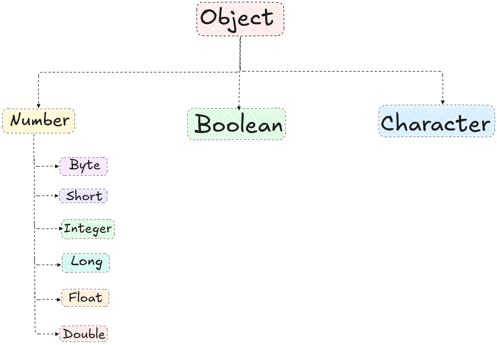

# java.lang Package

This package provides classes that are fundamental to the design of the Java programming language. The most important classes are Object, which is the root of the class hierarchy, and Class, instances of which represent classes at run time.

Frequently it is necessary to represent a value of primitive type as if it were an object. The wrapper classes Boolean, Character, Integer, Long, Float, and Double serve this purpose. An object of type Double, for example, contains a field whose type is double, representing that value in such a way that a reference to it can be stored in a variable of reference type. These classes also provide a number of methods for converting among primitive values, as well as supporting such standard methods as equals and hashCode. The Void class is a non-instantiable class that holds a reference to a Class object representing the type void.

The class Math provides commonly used mathematical functions such as sine, cosine, and square root. The classes String, StringBuffer, and StringBuilder similarly provide commonly used operations on character strings.

Classes ClassLoader, Process, ProcessBuilder, Runtime, SecurityManager, and System provide "system operations" that manage the dynamic loading of classes, creation of external processes, host environment inquiries such as the time of day, and enforcement of security policies.

Class Throwable encompasses objects that may be thrown by the throw statement. Subclasses of Throwable represent errors and exceptions.

java.lang class automatically imported into every Java program.

## Object Class

The Object class is the root of the class hierarchy. Every class has Object as a superclass. All objects, including arrays, implement the methods of this class.

Some of the most commonly used methods in the Object class include:

- `equals(Object obj)`: Indicates whether some other object is "equal to" this one.
- `hashCode()`: Returns a hash code value for the object.
- `toString()`: Returns a string representation of the object.
- `clone()`: Creates and returns a copy of this object.
- `finalize()`: Called by the garbage collector on an object when garbage collection determines that there are no more references to the object.
- `getClass()`: Returns the runtime class of this Object.
- `notify()`, `notifyAll()`, `wait()`: Methods for thread synchronization.
- `getClassLoader()`: Returns the class loader for the class of this object.
- `getClass()`: Returns the runtime class of this Object.

[Java Documentation for java.lang Package](https://docs.oracle.com/javase/8/docs/api/java/lang/Object.html)

## .equals() and == operator in Java

### Equality Operator(==)

In Java, we use the "==" operator to compare two variables of primitive data type and also compare objects. Just like equals() method, "==" also returns boolean output. Since "==" is an operator, it is not overrideable, so we avoid using it to compare two objects. It can be used to compare two variables of int, char, byte, short, long, boolean, float, and double types.

```java
import java.lang.*;
public class Demo {
  public static void main(String args[]) {
      int a=10;
      int b=20;
      int c=20;
      int d=a*2;
      System.out.println((a==b));
      System.out.println((c==d));
    }
  }
```

## Explanation:

- Here, we define five integers. For the first comparison, we can see that a is 10 and b is 20, so the result is `false`.
- For the second comparison, we can see that since c and d both are 20, we are getting `true` as a result.
- We have used the extra variables to show that the == operator does not compare the memory locations.

## Note:

- Using the "==" operator to compare two strings is not illegal, and hence, it will not cause any errors.
- But since it compares the locations of the strings and thus, it will not give the correct/desired output.

---

# **Java String equals() Method**

The `equals()` method in Java compares two objects for equality. It is defined in the **java.lang** package. The `equals()` method in Java checks whether two objects have the same content.

**Signature:**

```java
boolean equals(Object obj2)

```

Here, `obj2` is the object being compared against the object that calls the `equals()` method.

**Example usage:**

```java
boolean val = obj1.equals(obj2);

```

In this example, `obj1` is compared with `obj2`. The method returns `true` if the objects are equal; otherwise, it returns `false`.

**Example:**

```java
public class Main{
public static void main(String[] args){

        String s1 ="Java";
        String s2 ="Java";
        String s3 =new String("Java");

boolean res = s1.equals(s2);
        System.out.println(res);

       res = s1.equals(s3);
        System.out.println(res);

        res = s1.equals("java");

        System.out.println(res);

        res = s1.equals(null);
        System.out.println(res);
    }
}

```

**Output:**

```
true
true
false
false

```

**Points to Remember:**

- The `equals()` method compares strings character by character, making it an O(n) operation where n is the length of the shorter string.
- For case-insensitive string comparison, use the `equalsIgnoreCase()` function in Java.
- For lexicographic comparison between two strings, check out the `compareTo()` function in Java.

## **Difference between Comparing String Using == and .equals() in Java**

Let us look at the difference between == and .equals() in Java:

| **"==" Operator** | **equals() Method** |
| --- | --- |
| "==" is a Java operator. Hence, it can not be overridden. | equals() is a method in Java; hence, it can be overridden. |
| It is generally used to compare two variables of primitive data types but can also be used to compare objects. | It is used to compare objects. It can not compare primitive data types. |
| It compares the memory location of the objects. For the String objects, it compares them character by character if memory location equality fails. | It compares the data of the two variables, but in the case of objects, it compares the memory locations. |
| It takes O(1) time for comparison. | It takes O(1) time for normal objects and O(n) time for String objects. |
| It throws a compile time error if the two variables are not of the same data type. | It returns a "false" value if the objects are not of the same type. |

## We can override Object class methods like `equals()` , `hashCode()` , `toString()` and many others in our custom classes to provide meaningful equality checks and hashing behavior based on the attributes of the class.

## Wrapper Classes

Java provides wrapper classes for each of the primitive data types. These classes are part of the `java.lang` package and provide a way to In Java, all primitive data types are value types, which means variables of primitive types hold values directly in memory. Java provides built-in classes for each primitive type that convert these value types into object types. These built-in classes are known as wrapper classes or primitive wrapper classes. The table below shows each primitive data type and its corresponding wrapper class.

| Primitive Type | Wrapper Class |
| --- | --- |
| `byte` | Byte |
| `short` | Short |
| `int` | Integer |
| `long` | Long |
| `float` | Float |
| `double` | Double |
| `char` | Character |
| `boolean` | Boolean |

These classes are called wrapper classes because they wrap (enclose) primitive types and convert them into objects or non-primitive types. Additionally, these classes contain useful methods that are commonly used in Java programs.



## Autoboxing and AutoUnboxing in Java

1. **Autoboxing :** The automatic conversion of primitive type into an object of corresponding wrapper type is known as autoboxing. For example conversion of an int to an Integer or double to Double and so on. Autoboxing happens automatically, it's the compiler who does this for us.

2. **AutoUnboxing :** The automatic conversion of wrapper type object into corresponding primitive type is known as unboxing. For example conversion of Integer to an int or Double to double and so on. It also happens automatically, done by java compiler.

```java
  int i = 100;
 double d = 10.5;
 // Following are autoboxing
 Integer in = i;
 Integer ig = 20;
 Double db = d; 
 Double dl = 20.5; 
 // Following is not autoboxing
 // Integer in = new Integer(i);

 ----------------------------------------
 
 Integer in = new Integer(100);
 Double db = new Double(20.5);
 // Following are unboxing
 int i= in;
 double d = db;
 int j = new Integer(50);
 double k = new Double(50.5);
 // Following is not unboxing
 // int i = in.intValue();
```

## Integer class methods

Some commonly used methods of the Integer class are:

- `parseInt(String s)`: Converts a string to a primitive int.
- `valueOf(String s)`: Converts a string to an Integer object.
- `toString()`: Converts an Integer object to a string.
- `intValue()`: Returns the value of the Integer as a primitive int.
- `compareTo(Integer anotherInteger)`: Compares two Integer objects numerically.
- `equals(Object obj)`: Compares this Integer to the specified object.
- `hashCode()`: Returns a hash code for this Integer.
- `MAX_VALUE` and `MIN_VALUE`: Constants representing the maximum and minimum values an int can have.
- `bitCount(int i)`: Returns the number of one-bits in the two's complement binary representation of the specified int value.
- `highestOneBit(int i)`: Returns an int value with at most a single one-bit, in the position of the highest-order ("leftmost") one-bit in the specified int value.
- `lowestOneBit(int i)`: Returns an int value with at most a single one-bit, in the position of the lowest-order ("rightmost") one-bit in the specified int value.
- `toBinaryString(int i)`: Returns a string representation of the integer argument as an unsigned integer in base 2.
- `toHexString(int i)`: Returns a string representation of the integer argument as an unsigned integer in base 16.
- `toOctalString(int i)`: Returns a string representation of the integer argument as an unsigned integer in base 8.

## Float, Character and Boolean class

Some commonly used methods of the Float, Character and Boolean classes are:

- `Float.parseFloat(String s)`: Converts a string to a primitive float.
- `Float.valueOf(String s)`: Converts a string to a Float object.
- `Character.isDigit(char ch)`: Determines if the specified character is a digit.
- `Character.isLetter(char ch)`: Determines if the specified character is a letter.
- `Character.toUpperCase(char ch)`: Converts the character to uppercase.
- `Character.toLowerCase(char ch)`: Converts the character to lowercase.
- `Boolean.parseBoolean(String s)`: Converts a string to a primitive boolean.
- `Boolean.valueOf(String s)`: Converts a string to a Boolean object.
- `Boolean.toString()`: Converts a Boolean object to a string.
- `Boolean.equals(Object obj)`: Compares this Boolean to the specified object.
- `Boolean.hashCode()`: Returns a hash code for this Boolean.
- `Boolean.TRUE` and `Boolean.FALSE`: Constants representing the boolean values true and false.

## Math Class

The Math class in Java provides various mathematical functions and constants.

[Java Math Class Documentation](https://docs.oracle.com/javase/8/docs/api/java/lang/Math.html)

## enum Class

[Java Enum Documentation](https://www.refreshjava.com/java/enum-in-java)