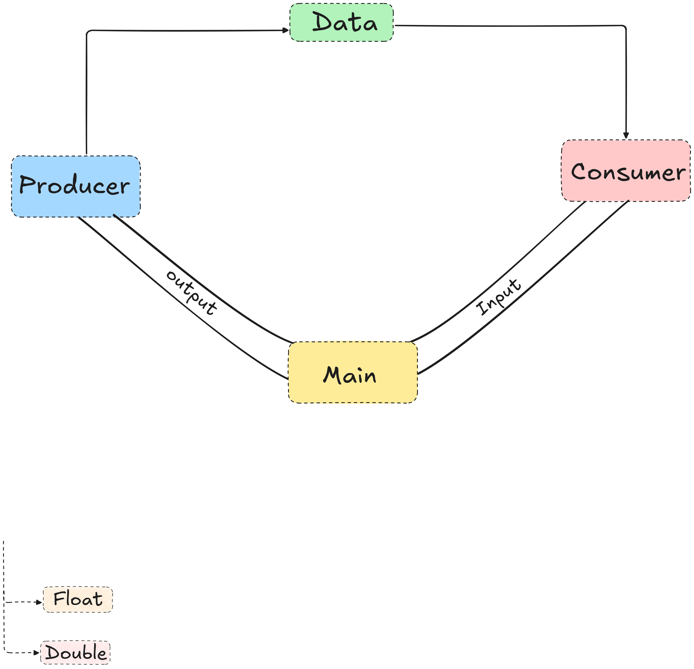

# Java IO Stream

## IO or Input Output

- Input: Data received from the resource for the program.
- Output: Data sent from the program to the resource.

## Stream

Introduced in **Java 8**, the Stream API processes collections of objects. A stream is a sequence of objects that supports various methods which can be pipelined to produce the desired result.

  or

- A stream is a sequence of data.
- It is a continuous flow of data.
  
## Why We Need IO Streams in Java?

In daily work, we do not enter input into programs manually. Also, the program's result needs to be stored somewhere for further use.

So, Java IO streams provide input and output streams that help us extract data from files and write the data into them. Normally, we can create, delete, and edit files using Java.io.

In short, all file manipulation is done using "Java IO streams, " which also handle user input functionality.

## What is Java IO Stream?

In Java, streams are the sequence of data that are read from the source and written to the destination.

An input stream is used to read data from the source. And, an output stream is used to write data to the destination.

## Types of Java IO Streams

There are two types of Java IO Streams present in java.io package:

1. Byte Stream
2. Character Stream
3. Buffered Stream

## Byte Stream

- In this program uses byte stream to perform input and output of 8-bit bytes.
- All byte stream classes are decendends of `InputStream` and `OutputStream` classes.

## InputStream and OutputStream

### InputStream

This abstract class is the superclass of all other classes representing an input stream of bytes.

Applications that need to define a subclass of InputStream must always provide a method that returns the next byte of input.

### Some commonly used methods:

| Modifier and Type | Method | Description |
| --- | --- | --- |
| `int` | `available()` | Returns an estimate of the number of bytes that can be read (or skipped over) from this input stream without blocking by the next invocation of a method for this input stream. |
| `void` | `close()` | Closes this input stream and releases any system resources associated with the stream. |
| `void` | `mark(int readlimit)` | Marks the current position in this input stream. |
| `boolean` | `markSupported()` | Tests if this input stream supports the `mark` and `reset` methods. |
| `abstract int` | `read()` | Reads the next byte of data from the input stream. |
| `int` | `read(byte[] b)` | Reads some number of bytes from the input stream and stores them into the buffer array `b`. |
| `int` | `read(byte[] b, int off, int len)` | Reads up to `len` bytes of data from the input stream into an array of bytes. |
| `void` | `reset()` | Repositions this stream to the position at the time the `mark` method was last called on this input stream. |
| `long` | `skip(long n)` | Skips over and discards `n` bytes of data from this input stream. |

### Reference-

[Official Documentation of InputStream](https://docs.oracle.com/javase/8/docs/api/java/io/InputStream.html)

### OutputStream

OutputStream is basically used to sending data from program to the resource.

More specifically, OutputStream is an abstract class that is the superclass of all classes representing an output stream of bytes.

### Some commonly used methods:

| Modifier and Type | Method | Description |
| --- | --- | --- |
| `void` | `close()` | Closes this output stream and releases any system resources associated with this stream. |
| `void` | `flush()` | Flushes this output stream and forces any buffered output bytes to be written out. |
| `void` | `write(byte[] b)` | Writes `b.length` bytes from the specified byte array to this output stream. |
| `void` | `write(byte[] b, int off, int len)` | Writes `len` bytes from the specified byte array starting at offset `off` to this output stream. |
| `abstract void` | `write(int b)` | Writes the specified byte to this output stream. |

### Reference-

[Official Documentation of OutputStream](https://docs.oracle.com/javase/8/docs/api/java/io/OutputStream.html)

## FileOutputStream:

### public class FileOutputStream extends OutputStream

- The `FileOutputStream` class is used to write data to a file in the form of a sequence of bytes.
- It is a subclass of `OutputStream` class.
- You can use `FileOutputStream` to create a new file or append data to an existing file.

### Some commonly used constructors:

| Constructor | Description |
| --- | --- |
| `FileOutputStream(File file)` | Creates a file output stream to write to the file represented by the specified File object. |
| `FileOutputStream(String name)` | Creates a file output stream to write to the file with the specified name. |
| `FileOutputStream(File file, boolean append)` | Creates a file output stream to write to the file represented by the specified File object. If the second argument is true, then bytes will be written to the end of the file rather than the beginning. |
| `FileOutputStream(String name, boolean append)` | Creates a file output stream to write to the file with the specified name. If the second argument is true, then bytes will be written to the end of the file rather than the beginning. |

### Using try-catch block with FileOutputStream

```java
// Java program to demonstrate FileOutputStream
import java.io.FileNotFoundException;
import java.io.FileOutputStream;
import java.io.IOException;
import java.io.*;
public class Demo {
  public static void main(String[] args) {
    try {
      FileOutputStream fs=new FileOutputStream("C:\\Users\\mohit\\Desktop\\Java_Programming/statics/test.txt");
      String str="This is Java programming..";
      try {
        fs.write(str.getBytes());
        fs.close();
      } catch (Exception e) {
        System.err.println(e);
      }
     
      
    } catch (FileNotFoundException e) {
      System.err.println(e);
    }
  }
}

```

### Using try-with-resources statement with FileOutputStream

```java
import java.io.*;
public class Demo{
  public static void main(String[] args) {
    
    try (FileOutputStream fos = new FileOutputStream("C:\\Users\\mohit\\Desktop\\Java_Programming\\statics\\test.txt")) {
        fos.write("Here we go again..".getBytes());
        System.out.println("Written in file completely..");
    }catch(IOException e) {
      System.err.println(e);
    }
  }
}
```

## SequenceInputStream

### public class SequenceInputStream extends InputStream

A SequenceInputStream represents the logical concatenation of other input streams. It starts out with an ordered collection of input streams and reads from the first one until end of file is reached, whereupon it reads from the second one, and so on, until end of file is reached on the last of the contained input streams.

```java
  FileInputStream fs1=new FileInputStream("file1.txt");
  FileInputStream fs2=new FileInputStream("file2.txt");
  SequenceInputStream sis=new SequenceInputStream(fs1, fs2);
  int b;
  while((b=sis.read())!= -1) {
    System.out.print((char)b); // OR CAN WRITE IN ANOTHER FILE
  }
```

## ByteArrayInputStream

### public class ByteArrayInputStream extends InputStream

ByteArrayInputStream contains an internal buffer that contains bytes that may be read from stream.An internal counter may be maintained to keep track of the next byte to be supplied by the read method.

```java
  byte[] b={'a','b','c','d'};
  ByteArrayInputStream bis=new ByteArrayInputStream(b);
  int a;
  while((a=bis.read())!= -1) {
    System.out.print((char)a);
  }
  bis.close();
```

## ByteArrayOutputStream

### public class ByteArrayOutputStream extends OutputStream

This class implements an output stream in which the data is written into a byte array. The buffer automatically grows as data is written to it. The data can be retrieved using toByteArray() and toString().

```java
import java.io.ByteArrayOutputStream;
import java.io.FileOutputStream;

public class ByteArrayO {
    public static void main(String[] args) throws Exception {
        ByteArrayOutputStream bos=new ByteArrayOutputStream(20);
        bos.write('a');
        bos.write('b');
        bos.write('x');
        bos.write('z');
        // byte b[]=bos.toByteArray();
        // for(byte x : b) {
        //     System.out.println(x);
        // }
        bos.writeTo(new FileOutputStream("a.txt"));
        bos.close();
        
    }
}
```

## CharArrayReader

### public class CharArrayReader extends Reader

This class implements a character buffer that can be used as a character-input stream.

```java
  char[] c={'a','b','c','d','e'};
  CharArrayReader car=new CharArrayReader(c);
  int i;
  while((i=car.read())!= -1) {
    System.out.print((char)i);
  }
  car.close();
```

## CharArrayWriter

### public class CharArrayWriter extends Writer

This class implements a character buffer that can be used as a character-output stream. The buffer automatically grows as data is written to it. The data can be retrieved using toCharArray() and toString().

```java
  CharArrayWriter caw=new CharArrayWriter();
  caw.write('a');
  caw.write('b');
  caw.write('c');
  caw.write('d');
  System.out.println(caw.toString());
  caw.close();
```

## Buffered Stream and Buffered Reader/Writer

## What is Buffer in Java?

Buffer is basically a container of data of a primitive type.

A buffer is a linear, finite sequence of elements of a specific primitive type. Aside from its content, the essential properties of a buffer are its capacity, limit, and position:

- A buffer's capacity is the number of elements it contains. The capacity of a buffer is never negative and never changes.

- A buffer's limit is the index of the first element that should not be read or written. A buffer's limit is never negative and is never greater than its capacity.

- A buffer's position is the index of the next element to be read or written. A buffer's position is never negative and is never greater than its limit.

## But why buffer needed ?

Buffer needed because there is a speed mismatch between the program and the I/O device. The program can process data much faster than an I/O device can supply or consume it. So, to bridge this speed gap, a buffer is used.

The buffer temporarily holds data that is being transferred between the program and the I/O device, allowing the program to continue processing while the I/O operation is still in progress. This helps to improve overall performance and efficiency.

For example, when reading data from a file, the program can read a large chunk of data into a buffer and then process it, rather than reading one byte at a time from the file. This reduces the number of I/O operations and improves performance.
Similarly, when writing data to a file, the program can write data to a buffer and then flush the buffer to the file in one go, rather than writing one byte at a time. This also reduces the number of I/O operations and improves performance.

buffer stores data byte by byte.
let say,we have a String greet="Hello"
then in buffer it will be stored like below:

| 'H' | 'e' | 'l' | 'l' | 'o' |
|---|---|---|---|---|

Each character is stored in a separate byte in the buffer.

## What are the Benefits of Using Buffered Streams in Java?

1. **Improved Performance**: Buffered streams reduce the number of I/O operations by grouping multiple read/write requests into a single operation, which improves performance significantly.
2. **Reduced Latency**: By minimizing the number of I/O operations, buffered streams help reduce latency, making data access faster.
3. **Efficient Resource Utilization**: Buffered streams make better use of system resources by reducing the overhead associated with frequent I/O operations.
4. **Simplicity**: Buffered streams provide a simple and convenient way to handle I/O operations without having to manage buffering manually.
5. **Flexibility**: Buffered streams can be easily combined with other stream types, allowing for flexible and modular I/O operations.
6. **Customizable Buffer Size**: Buffered streams allow you to specify the buffer size, enabling you to optimize performance based on your application's specific needs.
7. **Thread Safety**: Buffered streams are generally thread-safe, making them suitable for use in multi-threaded applications.
8. **Reduced System Calls**: By buffering data, the number of system calls made during I/O operations is reduced, which can lead to better overall system performance.
9. **Enhanced Data Integrity**: Buffered streams can help ensure data integrity by reducing the chances of data corruption during read/write operations, especially in networked environments.

#### The mark() method of BufferedReader class in Java is used to mark the current position in the buffer reader stream.
#### The reset() method of the same BufferedReader class is also called subsequently, after the mark() method is called.
#### The reset() method fixes the position at the last marked position so that same byte can be read again.

## Pipe Stream

### What is Pipe Stream in Java?

A pipe stream in Java is a type of stream that allows data to be transferred between two threads. It acts as a communication channel between the threads, enabling one thread to write data to the pipe while another thread reads data from it.



### Types of Pipe Streams in Java

There are two types of pipe streams in Java:

1. PipedInputStream: This class is used to read data from a pipe. It is connected to a PipedOutputStream, which writes data to the pipe.
2. PipedOutputStream: This class is used to write data to a pipe. It is connected to a PipedInputStream, which reads data from the pipe.
3. PipedReader: This class is used to read character data from a pipe. It is connected to a PipedWriter, which writes character data to the pipe.
4. PipedWriter: This class is used to write character data to a pipe. It is connected to a PipedReader, which reads character data from the pipe.