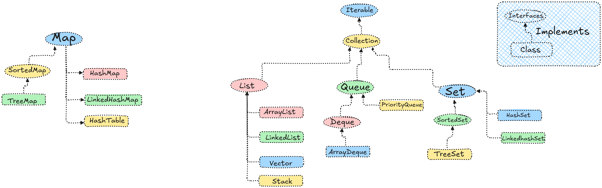

# Collection Framework

## 1. Introduction

- A collections framework is a unified architecture for representing and manipulating collections. All collections frameworks contain the following:

1. **Interfaces:** These are abstract data types that represent collections. Interfaces allow collections to be manipulated independently of the details of their representation. In object-oriented languages, interfaces generally form a hierarchy.
2. **Implementations:** These are the concrete implementations of the collection interfaces. In essence, they are reusable data structures.
3. **Algorithms:** These are the methods that perform useful computations, such as searching and sorting, on objects that implement collection interfaces. The algorithms are said to be polymorphic: that is, the same method can be used on many different implementations of the appropriate collection interface. In essence, algorithms are reusable functionality.

## 2. What is the need of Collection Framework?

- The collection framework provides a set of interfaces and classes that allow developers to work with data structures in a consistent and efficient manner. It offers a standardized way to store, manipulate, and access collections of objects, such as lists, sets, maps, and queues. The collection framework simplifies the development process by providing ready-to-use implementations of common data structures and algorithms, reducing the need for developers to write their own code from scratch. Additionally, it promotes code reusability and enhances the performance of applications by providing optimized implementations of data structures and algorithms.
- The collection framework also provides a common set of methods for working with collections, making it easier for developers to learn and use different types of collections without having to understand the underlying implementation details. This promotes code readability and maintainability, as developers can focus on the logic of their applications rather than the intricacies of data structure implementation. Overall, the collection framework is essential for efficient and effective data management in programming languages.
  
## 3. Benefits of Collection Framework

1. **Code Reusability:** The collection framework provides a set of pre-built data structures and algorithms that can be reused across different applications, saving time and effort for developers.
2. **Improved Performance:** The collection framework offers optimized implementations of data structures and algorithms, which can enhance the performance of applications by providing efficient ways to store and manipulate data.
3. **Consistency:** The collection framework provides a standardized way to work with collections, making it easier for developers to learn and use different types of collections without having to understand the underlying implementation details. This promotes code readability and maintainability.
4. **Flexibility:** The collection framework allows developers to choose from a variety of data structures and algorithms based on their specific needs, providing flexibility in how data is stored and manipulated.
5. **Interoperability:** The collection framework provides a common set of interfaces and classes that can be used across different programming languages, allowing for interoperability and easier integration of code between different systems. This promotes code sharing and collaboration among developers working on different platforms.

There is also builtin Array provided by Java compiler but it has some limitations like:

1. **Fixed Size:** Once an array is created, its size cannot be changed. This can lead to issues if the number of elements to be stored is not known in advance or if it exceeds the initial size of the array.

2. **Lack of Built-in Methods:** Arrays do not have built-in methods for common operations such as adding, removing, or searching for elements. This means that developers have to write their own code to perform these operations, which can be time-consuming and error-prone.
3. **Type Safety:** Arrays are not type-safe, meaning that they can store elements of different types. This can lead to runtime errors if the wrong type of element is added to the array or if an element is accessed with the wrong type.
4. **Inefficient Memory Usage:** Arrays can lead to inefficient memory usage if the initial size is too large, as it may allocate more memory than needed. Conversely, if the initial size is too small, it may require resizing the array, which can be costly in terms of performance.
5. **Lack of Flexibility:** Arrays do not provide the flexibility to easily add or remove elements, which can make it difficult to manage dynamic data. This can lead to issues when working with collections of data that may change in size over time.
6. **Limited Functionality:** Arrays do not provide the rich set of functionalities that collection frameworks offer, such as sorting, searching, and iterating over elements. This can make it more difficult to work with arrays compared to using a collection framework that provides these features out of the box.

Collection frameworks, on the other hand, provide dynamic data structures that can grow and shrink as needed, along with a wide range of built-in methods for common operations. They also offer type safety, efficient memory usage, and enhanced functionality, making them a more versatile and powerful option for managing collections of data in programming languages.



In the above image, we can see that the collection framework provides a hierarchy of interfaces and classes for different types of collections, such as lists, sets, maps, and queues. Each interface defines a set of methods that can be implemented by various classes, allowing for flexibility and reusability in how collections are used and manipulated in programming languages.

There are some interfaces in the collection framework, such as:

1. **Collection Interface:** This is the root interface of the collection framework and defines the basic operations that can be performed on a collection, such as adding, removing, and checking for the presence of elements.
2. **List Interface:** This interface extends the Collection interface and represents an ordered collection of elements. It allows for duplicate elements and provides methods for accessing elements by their index.
3. **Set Interface:** This interface extends the Collection interface and represents a collection that does not allow duplicate elements. It provides methods for checking if an element is present and for retrieving elements in no particular order.
4. **Map Interface:** This interface represents a collection of key-value pairs, where each key is unique. It provides methods for adding, removing, and retrieving values based on their corresponding keys.
5. **Queue Interface:** This interface represents a collection that follows the First-In-First-Out (FIFO) principle. It provides methods for adding elements to the end of the queue and removing elements from the front of the queue.
6. **Deque Interface:** This interface represents a collection that allows elements to be added or removed from both ends. It provides methods for adding and removing elements from both the front and the back of the deque.
7. **SortedSet Interface:** This interface extends the Set interface and represents a collection that maintains its elements in a sorted order. It provides methods for retrieving elements in a specific order and for performing range-based operations on the set.
8. **SortedMap Interface:** This interface extends the Map interface and represents a collection of key-value pairs that maintains its keys in a sorted order. It provides methods for retrieving values based on their corresponding keys and for performing range-based operations on the map.

---
All of these are present in java.util package and we can use them by importing the package in our code. Each of these interfaces has multiple implementations that provide different functionalities and performance characteristics, allowing developers to choose the most appropriate collection type for their specific use case.

---

## 1. Adding elements

- **`add(E e)`**
    
    Adds a single element to the collection.
    
    Returns `true` if the collection changed.
    
- **`addAll(Collection<? extends E> c)`**
    
    Adds **all elements** from another collection `c` into this one.
    
    Returns `true` if at least one element was added.
    

---

## 2. Removing elements

- **`remove(Object o)`**
    
    Removes **one occurrence** of the specified object if present.
    
    Returns `true` if something was removed.
    
- **`removeAll(Collection<?> c)`**
    
    Removes **every element** from this collection that is also in collection `c`.
    
    (Think: subtracting another collection.)
    
- **`retainAll(Collection<?> c)`**
    
    Keeps **only the elements that are also in `c`** and removes the rest.
    
    (Think: intersection of two collections.)
    
- **`clear()`**
    
    Removes **all elements**.
    
    Collection becomes empty.
    

---

## 3. Checking collection state

- **`isEmpty()`**
    
    Returns `true` if the collection has **no elements**.
    
- **`contains(Object o)`**
    
    Returns `true` if the collection **has at least one element equal to `o`**.
    
- **`containsAll(Collection<?> c)`**
    
    Returns `true` if this collection contains **every element** of `c`.
    
- **`equals(Object o)`**
    
    Checks **logical equality** between two collections
    
    (same elements, often same order depending on implementation like `List` vs `Set`).
    
- **`size()`**
    
    Returns the **number of elements** in the collection.
    

---

## 4. Traversing & converting

- **`iterator()`**
    
    Returns an **Iterator** used to loop through elements safely:
    
    ```java
    for (E e : collection) { ... }
    ```
    
- **`toArray()`**
    
    Converts the collection into an **array of `Object`**
    
    (there’s also a typed version `toArray(T[] a)`).
    

---

# Quick mental model

Think of `Collection` as giving you **four core abilities**:

| Category | Purpose |
| --- | --- |
| Add | `add`, `addAll` |
| Remove | `remove`, `removeAll`, `retainAll`, `clear` |
| Check | `contains`, `containsAll`, `isEmpty`, `equals`, `size` |
| Traverse/Convert | `iterator`, `toArray` |
