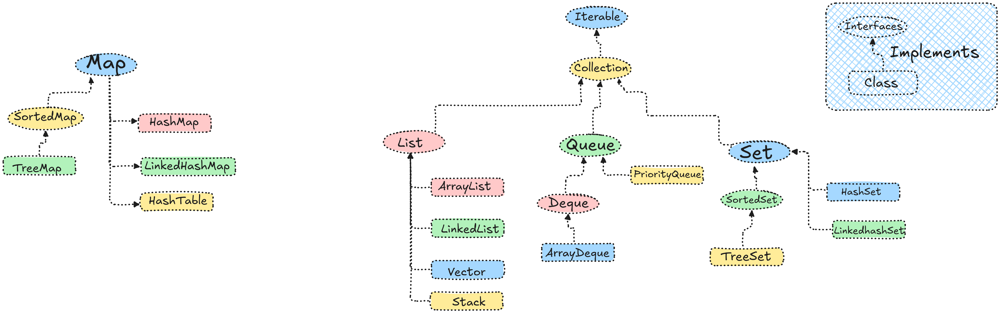

# Collection Framework

## 1. Introduction

- A collections framework is a unified architecture for representing and manipulating collections. All collections frameworks contain the following:

1. **Interfaces:** These are abstract data types that represent collections. Interfaces allow collections to be manipulated independently of the details of their representation. In object-oriented languages, interfaces generally form a hierarchy.
2. **Implementations:** These are the concrete implementations of the collection interfaces. In essence, they are reusable data structures.
3. **Algorithms:** These are the methods that perform useful computations, such as searching and sorting, on objects that implement collection interfaces. The algorithms are said to be polymorphic: that is, the same method can be used on many different implementations of the appropriate collection interface. In essence, algorithms are reusable functionality.

## 2. What is the need of Collection Framework?

- The collection framework provides a set of interfaces and classes that allow developers to work with data structures in a consistent and efficient manner. It offers a standardized way to store, manipulate, and access collections of objects, such as lists, sets, maps, and queues. The collection framework simplifies the development process by providing ready-to-use implementations of common data structures and algorithms, reducing the need for developers to write their own code from scratch. Additionally, it promotes code reusability and enhances the performance of applications by providing optimized implementations of data structures and algorithms.
- The collection framework also provides a common set of methods for working with collections, making it easier for developers to learn and use different types of collections without having to understand the underlying implementation details. This promotes code readability and maintainability, as developers can focus on the logic of their applications rather than the intricacies of data structure implementation. Overall, the collection framework is essential for efficient and effective data management in programming languages.

## 3. Benefits of Collection Framework

1. **Code Reusability:** The collection framework provides a set of pre-built data structures and algorithms that can be reused across different applications, saving time and effort for developers.
2. **Improved Performance:** The collection framework offers optimized implementations of data structures and algorithms, which can enhance the performance of applications by providing efficient ways to store and manipulate data.
3. **Consistency:** The collection framework provides a standardized way to work with collections, making it easier for developers to learn and use different types of collections without having to understand the underlying implementation details. This promotes code readability and maintainability.
4. **Flexibility:** The collection framework allows developers to choose from a variety of data structures and algorithms based on their specific needs, providing flexibility in how data is stored and manipulated.
5. **Interoperability:** The collection framework provides a common set of interfaces and classes that can be used across different programming languages, allowing for interoperability and easier integration of code between different systems. This promotes code sharing and collaboration among developers working on different platforms.

There is also builtin Array provided by Java compiler but it has some limitations like:

1. **Fixed Size:** Once an array is created, its size cannot be changed. This can lead to issues if the number of elements to be stored is not known in advance or if it exceeds the initial size of the array.

2. **Lack of Built-in Methods:** Arrays do not have built-in methods for common operations such as adding, removing, or searching for elements. This means that developers have to write their own code to perform these operations, which can be time-consuming and error-prone.
3. **Type Safety:** Arrays are not type-safe, meaning that they can store elements of different types. This can lead to runtime errors if the wrong type of element is added to the array or if an element is accessed with the wrong type.
4. **Inefficient Memory Usage:** Arrays can lead to inefficient memory usage if the initial size is too large, as it may allocate more memory than needed. Conversely, if the initial size is too small, it may require resizing the array, which can be costly in terms of performance.
5. **Lack of Flexibility:** Arrays do not provide the flexibility to easily add or remove elements, which can make it difficult to manage dynamic data. This can lead to issues when working with collections of data that may change in size over time.
6. **Limited Functionality:** Arrays do not provide the rich set of functionalities that collection frameworks offer, such as sorting, searching, and iterating over elements. This can make it more difficult to work with arrays compared to using a collection framework that provides these features out of the box.

Collection frameworks, on the other hand, provide dynamic data structures that can grow and shrink as needed, along with a wide range of built-in methods for common operations. They also offer type safety, efficient memory usage, and enhanced functionality, making them a more versatile and powerful option for managing collections of data in programming languages.



In the above image, we can see that the collection framework provides a hierarchy of interfaces and classes for different types of collections, such as lists, sets, maps, and queues. Each interface defines a set of methods that can be implemented by various classes, allowing for flexibility and reusability in how collections are used and manipulated in programming languages.

There are some interfaces in the collection framework, such as:

1. **Collection Interface:** This is the root interface of the collection framework and defines the basic operations that can be performed on a collection, such as adding, removing, and checking for the presence of elements.
2. **List Interface:** This interface extends the Collection interface and represents an ordered collection of elements. It allows for duplicate elements and provides methods for accessing elements by their index.
3. **Set Interface:** This interface extends the Collection interface and represents a collection that does not allow duplicate elements. It provides methods for checking if an element is present and for retrieving elements in no particular order.
4. **Map Interface:** This interface represents a collection of key-value pairs, where each key is unique. It provides methods for adding, removing, and retrieving values based on their corresponding keys.
5. **Queue Interface:** This interface represents a collection that follows the First-In-First-Out (FIFO) principle. It provides methods for adding elements to the end of the queue and removing elements from the front of the queue.
6. **Deque Interface:** This interface represents a collection that allows elements to be added or removed from both ends. It provides methods for adding and removing elements from both the front and the back of the deque.
7. **SortedSet Interface:** This interface extends the Set interface and represents a collection that maintains its elements in a sorted order. It provides methods for retrieving elements in a specific order and for performing range-based operations on the set.
8. **SortedMap Interface:** This interface extends the Map interface and represents a collection of key-value pairs that maintains its keys in a sorted order. It provides methods for retrieving values based on their corresponding keys and for performing range-based operations on the map.

---

All of these are present in `java.util` package and we can use them by importing the package in our code. Each of these interfaces has multiple implementations that provide different functionalities and performance characteristics, allowing developers to choose the most appropriate collection type for their specific use case.

---

## 1. Adding elements

- **`add(E e)`**
  Adds a single element to the collection.
  Returns `true` if the collection changed.
- **`addAll(Collection<? extends E> c)`**
  Adds **all elements** from another collection `c` into this one.
  Returns `true` if at least one element was added.

---

## 2. Removing elements

- **`remove(Object o)`**
  Removes **one occurrence** of the specified object if present.
  Returns `true` if something was removed.
- **`removeAll(Collection<?> c)`**
  Removes **every element** from this collection that is also in collection `c`.
  (Think: subtracting another collection.)
- **`retainAll(Collection<?> c)`**
  Keeps **only the elements that are also in `c`** and removes the rest.
  (Think: intersection of two collections.)
- **`clear()`**
  Removes **all elements**.
  Collection becomes empty.

---

## 3. Checking collection state

- **`isEmpty()`**
  Returns `true` if the collection has **no elements**.
- **`contains(Object o)`**
  Returns `true` if the collection **has at least one element equal to `o`**.
- **`containsAll(Collection<?> c)`**
  Returns `true` if this collection contains **every element** of `c`.
- **`equals(Object o)`**
  Checks **logical equality** between two collections
  (same elements, often same order depending on implementation like `List` vs `Set`).
- **`size()`**
  Returns the **number of elements** in the collection.

---

## 4. Traversing & converting

- **`iterator()`**
  Returns an **Iterator** used to loop through elements safely:
  ```java
  for (E e : collection) { ... }
  ```
- **`toArray()`**
  Converts the collection into an **array of `Object`**
  (there’s also a typed version `toArray(T[] a)`).

---

# Quick mental model

Think of `Collection` as giving you **four core abilities**:

| Category         | Purpose                                                |
| ---------------- | ------------------------------------------------------ |
| Add              | `add`, `addAll`                                        |
| Remove           | `remove`, `removeAll`, `retainAll`, `clear`            |
| Check            | `contains`, `containsAll`, `isEmpty`, `equals`, `size` |
| Traverse/Convert | `iterator`, `toArray`                                  |

## `List` Interface (extends Collection)

Extra methods shown:

```
add(int index, E e)
addAll(int index, Collection<E> c)
remove(int index)
get(int index)
set(int index, E e)
subList(int from, int to)
indexOf(Object o)
lastIndexOf(Object o)
listIterator()
listIterator(int index)
```

---

## Example

```java
importjava.util.*;

publicclassMain {
publicstaticvoidmain(String[]args) {
List<String>list=newArrayList<>();

list.add("A");
list.add("B");
list.add("C");

list.add(1,"X");// insert at index 1
System.out.println(list);// [A, X, B, C]

list.remove(2);// remove element at index 2
System.out.println(list);// [A, X, C]

System.out.println(list.get(1));// X

list.set(1,"Y");// replace index 1
System.out.println(list);// [A, Y, C]

System.out.println(list.indexOf("Y"));// 1
System.out.println(list.lastIndexOf("C"));// 2

List<String>sub=list.subList(0,2);
System.out.println(sub);// [A, Y]
    }
}
```

### **Common Operations on ArrayList :**

| Operation          | Description              | Time Complexity |
| ------------------ | ------------------------ | --------------- |
| `add(e)`           | Add element at end       | O(1) amortized  |
| `add(index, e)`    | Insert at specific index | O(n)            |
| `get(index)`       | Access element by index  | O(1)            |
| `set(index, e)`    | Replace element at index | O(1)            |
| `remove(index)`    | Remove element at index  | O(n)            |
| `remove(Object o)` | Remove first occurrence  | O(n)            |
| `contains(e)`      | Check if element exists  | O(n)            |
| `indexOf(e)`       | Find index of element    | O(n)            |
| `size()`           | Number of elements       | O(1)            |
| `isEmpty()`        | Check if list is empty   | O(1)            |
| `clear()`          | Remove all elements      | O(n)            |
| `iterator()`       | Create iterator          | O(1)            |

**For more Check Java Documentation.**

## Array Deque

- **`ArrayDeque`** is a resizable array implementation of the `Deque` interface.
- There is no capacity restriction on this as it grows as necessary to accommodate new elements.
- It is not thread-safe and does not support concurrent access by multiple threads.
- It is faster than `LinkedList` when used as a stack (LIFO) or queue (FIFO) due to better cache locality.
- It does not allow `null` elements and throws `NullPointerException` if you try to add `null`.

### **Common Operations on** ArrayDeque

### Queue Operations

| Operation          | Description             | Time Complexity |
| ------------------ | ----------------------- | --------------- |
| `offerLast(e)`     | Insert at rear          | O(1) amortized  |
| `offerFirst(e)`    | Insert at front         | O(1) amortized  |
| `pollFirst()`      | Remove from front       | O(1)            |
| `pollLast()`       | Remove from rear        | O(1)            |
| `peekFirst()`      | View front element      | O(1)            |
| `peekLast()`       | View rear element       | O(1)            |
| `size()`           | Number of elements      | O(1)            |
| `isEmpty()`        | Check if empty          | O(1)            |
| `clear()`          | Remove all elements     | O(n)            |
| `contains(e)`      | Search element          | O(n)            |
| `remove(Object o)` | Remove first occurrence | O(n)            |

### Stack Operations

| Operation          | Description                           | Time Complexity |
| ------------------ | ------------------------------------- | --------------- |
| `add(e)`           | Add element at the rear               | O(1) amortized  |
| `offer(e)`         | Add element at the rear               | O(1) amortized  |
| `addFirst(e)`      | Insert at front                       | O(1) amortized  |
| `offerFirst(e)`    | Insert at front                       | O(1) amortized  |
| `addLast(e)`       | Insert at rear                        | O(1) amortized  |
| `offerLast(e)`     | Insert at rear                        | O(1) amortized  |
| `removeFirst()`    | Remove front element                  | O(1)            |
| `pollFirst()`      | Remove and return front element       | O(1)            |
| `removeLast()`     | Remove rear element                   | O(1)            |
| `pollLast()`       | Remove and return rear element        | O(1)            |
| `getFirst()`       | Return front element                  | O(1)            |
| `peekFirst()`      | Return front element without removing | O(1)            |
| `getLast()`        | Return rear element                   | O(1)            |
| `peekLast()`       | Return rear element without removing  | O(1)            |
| `push(e)`          | Push element onto stack               | O(1) amortized  |
| `pop()`            | Pop top stack element                 | O(1)            |
| `peek()`           | View top stack element                | O(1)            |
| `contains(e)`      | Check if element exists               | O(n)            |
| `remove(Object o)` | Remove first occurrence               | O(n)            |
| `size()`           | Number of elements                    | O(1)            |
| `isEmpty()`        | Check if deque is empty               | O(1)            |
| `clear()`          | Remove all elements                   | O(n)            |

Example:

```java
ArrayDeque<Integer>deque=newArrayDeque<>();

deque.offerLast(10);// Queue enqueue
deque.pollFirst();// Queue dequeue

deque.push(20);// Stack push
deque.pop();// Stack pop
queue.offerLast(30); // stack push
queue.pollLast(); // stack pop
```

### Quick Comparison

| Operation                | ArrayList      | ArrayDeque     |
| ------------------------ | -------------- | -------------- |
| Add at end               | O(1) amortized | O(1) amortized |
| Remove at end            | O(1)           | O(1)           |
| Add at front             | O(n)           | O(1)           |
| Remove at front          | O(n)           | O(1)           |
| Random access (`get(i)`) | O(1)           | Not supported  |
| Search                   | O(n)           | O(n)           |

## Priority Queue

- **`PriorityQueue`** is a queue that orders its elements based on their natural ordering (for `Comparable` elements) or by a provided `Comparator`.
- It is implemented as a binary heap, which allows for efficient retrieval of the minimum (or maximum) element.
- It does not allow `null` elements and throws `NullPointerException` if you try to add `null`.
- It is not thread-safe and does not support concurrent access by multiple threads.
- The `poll()` method retrieves and removes the head of the queue, which is the element with the highest priority (the smallest element in a min-heap or the largest element in a max-heap). If the queue is empty, it returns `null`. The `peek()` method retrieves but does not remove the head of the queue, returning `null` if the queue is empty.
- The `offer(E e)` method adds an element to the queue and returns `true` if the element was added successfully. If the queue is full (which is not a concern for `PriorityQueue` since it resizes as needed), it would return `false`. However, since `PriorityQueue` does not have a fixed capacity, it will always return `true` unless you try to add a `null` element, in which case it will throw a `NullPointerException`.

### maxHeap example:

```java
import java.util.*;
public class Main {
    public static void main(String[] args) {
        // Create a max-heap using a custom comparator
        PriorityQueue<Integer> maxHeap = new PriorityQueue<>(Collections.reverseOrder());
        PriorityQueue<Integer> minHeap = new PriorityQueue<>();
        PriorityQueue<String> stringHeap = new PriorityQueue<>(); // Natural ordering (lexicographical)
        PriorityQueue<Integer>min_heap=new PriorityQueue<>((o1,o2)->Integer.compare(o1,o2));
        PriorityQueue<Integer>max_heap= new PriorityQueue<>((o1,o2)-> Integer.compare(o2,o1));

        // Add elements to the max-heap
        maxHeap.offer(10);
        maxHeap.offer(20);
        maxHeap.offer(5);
        maxHeap.offer(15);

        // Retrieve and remove elements from the max-heap
        while (!maxHeap.isEmpty()) {
            System.out.println(maxHeap.poll()); // Outputs: 20, 15, 10, 5
        }
    }
}
```

### **Common Operations on `PriorityQueue`:**

| **Operation**   | **Description**                               | **Time Complexity** |
| --------------- | --------------------------------------------- | ------------------- |
| **add(e)**      | Inserts element `e` into the queue.           | O(log n)            |
| **offer(e)**    | Inserts element `e` into the queue.           | O(log n)            |
| **poll()**      | Removes and returns the top element.          | O(log n)            |
| **peek()**      | Returns the top element without removing it.  | O(1)                |
| **remove()**    | Removes a specified element from the queue.   | O(n)                |
| **size()**      | Returns the number of elements in the queue.  | O(1)                |
| **clear()**     | Removes all elements from the queue.          | O(n)                |
| **contains(e)** | Checks if the queue contains the element `e`. | O(n)                |

#

### What is a HashSet?

A `HashSet` is a collection that stores **unique elements**. It is implemented internally using a hash table (actually a `HashMap` in Java).

Characteristics:

- No duplicate elements allowed.
- No guaranteed insertion order.
- Allows one `null` element.
- Fast insertion, deletion, and lookup on average.
- Not synchronized (not thread-safe).

Example:

```java
HashSet<Integer>set=newHashSet<>();

set.add(10);
set.add(20);
set.add(10);// Duplicate, ignored

System.out.println(set);
```

Output:

```java
[10, 20]
```

The second `10` is not added because sets contain only unique values.

### How HashSet Works

When you add an element:

```java
set.add("Hello");
```

Java:

1. Computes the element's `hashCode()`.
2. Uses the hash code to determine a bucket.
3. Stores the element in that bucket.
4. Uses `equals()` to check for duplicates.

This is why objects stored in a `HashSet` should properly override `hashCode()` and `equals()`.

### Common Operations on HashSet

| Operation     | Description             | Time Complexity |
| ------------- | ----------------------- | --------------- |
| `add(e)`      | Add element             | O(1) average    |
| `remove(e)`   | Remove element          | O(1) average    |
| `contains(e)` | Check if element exists | O(1) average    |
| `size()`      | Number of elements      | O(1)            |
| `isEmpty()`   | Check if set is empty   | O(1)            |
| `clear()`     | Remove all elements     | O(n)            |
| `iterator()`  | Create iterator         | O(1)            |
| `forEach()`   | Traverse elements       | O(n)            |

### HashSet vs ArrayList

| Feature             | HashSet                 | ArrayList                  |
| ------------------- | ----------------------- | -------------------------- |
| Duplicates          | Not allowed             | Allowed                    |
| Ordering            | No guarantee            | Preserves insertion order  |
| Search (`contains`) | O(1) average            | O(n)                       |
| Add                 | O(1) average            | O(1) amortized             |
| Index access        | Not supported           | O(1)                       |
| Use case            | Fast membership testing | Ordered list with indexing |

### How HashSet checks duplicates

When you do:

```java
set.add(obj);
```

HashSet:

1. Calls `obj.hashCode()`.
2. Finds the bucket using that hash code.
3. If the bucket already contains elements, calls `equals()` to check if an equivalent object already exists.
4. If `equals()` returns `true`, the new object is not added.

So:

```java
hashCode()  ->findsbucket
equals()    ->confirmsequality
```

Both are needed.

### What is Load Factor?

Load factor determines **when the hash table should resize**.

Formula:

`Threshold=Capacity×Load Factor`

For your example:

- Capacity = 20
- Load Factor = 0.75

Threshold:

```java
20 × 0.75 = 15
```

After approximately 15 elements are inserted, the hash table grows to a larger size and rehashes its entries.

### Why not wait until capacity is full?

Suppose capacity is 20 and you insert 20 elements.

Many buckets become crowded:

```java
Bucket 1 -> A -> B -> C
Bucket 2 -> D -> E
Bucket 3 -> F -> G -> H
```

Searches become slower.

The load factor is a trade-off between:

| Lower Load Factor      | Higher Load Factor     |
| ---------------------- | ---------------------- |
| More memory usage      | Less memory usage      |
| Faster lookups         | Slower lookups         |
| More frequent resizing | Less frequent resizing |

### Common Values

| Load Factor | Characteristics              |
| ----------- | ---------------------------- |
| `0.5f`      | Faster lookups, more memory  |
| `0.75f`     | General-purpose default      |
| `1.0f`      | Less memory, more collisions |
| `>1.0f`     | Usually not recommended      |

```java
newHashSet<>(capacity,loadFactor)
```

- `capacity` = initial number of buckets.
- `loadFactor` = percentage of capacity that can be filled before resizing.
- Default load factor is `0.75f`, which provides a good balance between memory usage and performance.

## TreeSet

A `TreeSet` is a Set implementation that stores **unique elements in sorted order**.

It is implemented internally using a self-balancing binary search tree called a **Red-Black Tree**.

```java
TreeSet<Integer>set=newTreeSet<>();
```

Characteristics:

- No duplicate elements.
- Elements are automatically sorted.
- Does **not** allow `null` (in modern Java versions).
- Slower than `HashSet` for basic operations.
- Implements `NavigableSet` and `SortedSet`.

---

### Example

```java
TreeSet<Integer>set=newTreeSet<>();

set.add(50);
set.add(10);
set.add(30);
set.add(20);
set.add(10);// Duplicate

System.out.println(set);
```

Output:

```java
[10, 20, 30, 50]
```

Notice:

- Duplicate `10` is ignored.
- Elements are automatically sorted.

---

### Common Operations on TreeSet

| Operation     | Description             | Time Complexity |
| ------------- | ----------------------- | --------------- |
| `add(e)`      | Add element             | O(log n)        |
| `remove(e)`   | Remove element          | O(log n)        |
| `contains(e)` | Check existence         | O(log n)        |
| `first()`     | Smallest element        | O(log n)        |
| `last()`      | Largest element         | O(log n)        |
| `higher(e)`   | Next greater element    | O(log n)        |
| `lower(e)`    | Next smaller element    | O(log n)        |
| `ceiling(e)`  | ≥ e                     | O(log n)        |
| `floor(e)`    | ≤ e                     | O(log n)        |
| `pollFirst()` | Remove smallest element | O(log n)        |
| `pollLast()`  | Remove largest element  | O(log n)        |
| `size()`      | Number of elements      | O(1)            |
| `isEmpty()`   | Check empty             | O(1)            |
| `clear()`     | Remove all elements     | O(n)            |

### Custom Objects in TreeSet

A `TreeSet` must know how to compare elements.

Either:

1. Implement `Comparable`

```java
class Student implements Comparable<Student> {
int id;

Student(intid) {
this.id=id;
    }

    @Override
public int compareTo(Students) {
returnthis.id-s.id;
    }
}
```

or

1. Provide a `Comparator`

```java
TreeSet<Student>set=newTreeSet<>((a,b) ->a.id-b.id)
```

## TreeMap and HashMap

- **`HashMap`** is a hash table-based implementation of the `Map` interface that allows for fast retrieval of key-value pairs based on their keys. It does not maintain any order of the keys and allows one `null` key and multiple `null` values.
- **`TreeMap`** is a Red-Black tree-based implementation of the `Map` interface that maintains its keys in sorted order. It does not allow `null` keys but allows multiple `null` values. The keys are ordered either by their natural ordering (if they implement `Comparable`) or by a provided `Comparator`.
- Both `HashMap` and `TreeMap` are not synchronized and do not support concurrent access by multiple threads. The choice between them depends on whether you need sorted keys (`TreeMap`) or faster access based on hashing (`HashMap`).
- In summary, `HashMap` is generally faster for most operations when order is not important, while `TreeMap` is useful when you need to maintain a sorted order of keys.

### Common Operations on TreeMap and HashMap

| Operation              | Description                                           | Time Complexity (HashMap) | Time Complexity (TreeMap) |
| ---------------------- | ----------------------------------------------------- | ------------------------- | ------------------------- |
| `put(key, value)`      | Add or update a key-value pair                        | O(1) average              | O(log n)                  |
| `get(key)`             | Retrieve value by key                                 | O(1) average              | O(log n)                  |
| `remove(key)`          | Remove key-value pair by key                          | O(1) average              | O(log n)                  |
| `containsKey(key)`     | Check if a key exists in the map                      | O(1) average              | O(log n)                  |
| `containsValue(value)` | Check if a value exists in the map                    | O(n)                      | O(n)                      |
| `size()`               | Number of key-value pairs                             | O(1)                      | O(1)                      |
| `isEmpty()`            | Check if the map is empty                             | O(1)                      | O(1)                      |
| `clear()`              | Remove all key-value pairs                            | O(n)                      | O(n)                      |
| `keySet()`             | Get a set of all keys in the map                      | O(1)                      | O(1)                      |
| `values()`             | Get a collection of all values in the map             | O(1)                      | O(1)                      |
| `entrySet()`           | Get a set of all key-value pairs as Map.Entry objects | O(1)                      | O(1)                      |
